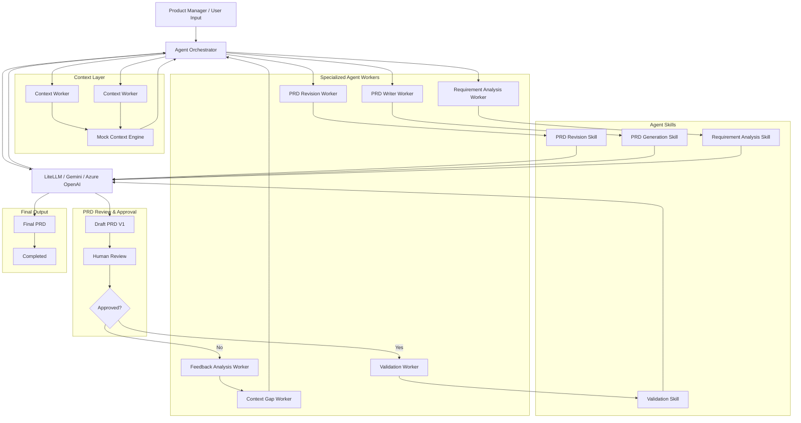

# Agentic AI Architecture

## Overview

This project implements an agentic product requirements document (PRD) generation workflow. It combines a FastAPI backend, a LangGraph-based orchestration layer, specialized agent-like workers, and an LLM integration layer to transform unstructured business context into a structured PRD.

The architecture follows a layered approach:

- Context acquisition and normalization
- Agent and skill orchestration
- LLM-based reasoning and generation
- Human review and approval flow
- Final PRD output generation

---

## High-Level Architecture

---

## Core Architectural Layers

### 1. Presentation / Client Layer

This layer is intentionally lightweight and is represented by the product manager or business user input. The system accepts context from:

- raw business notes
- uploaded documents
- structured JSON-like context
- problem statements and constraints

In the current implementation, the user-facing interaction is primarily through the FastAPI endpoints exposed by the backend service.

### 2. API Layer

The backend exposes REST endpoints using FastAPI.

Key entry points:

- `/context` routes for context analysis
- `/prd` routes for PRD generation

Main API files:

- `backend/src/main.py`
- `backend/src/api/context_api.py`
- `backend/src/api/prd_api.py`

This layer acts as the interface between external inputs and internal workflow orchestration.

### 3. Orchestration Layer

The orchestration is based on LangGraph and is defined in:

- `backend/src/graph/workflow.py`
- `backend/src/graph/state.py`

This workflow compiles a state graph with a context analyzer node as the initial stage. The graph handles the state transitions and process flow of the agentic pipeline.

The core idea is that the application manages shared state while each stage either enriches context, analyzes requirements, or routes the workflow toward review or generation.

### 4. Agent / Worker Layer

The system organizes work into specialized worker roles.

Representative responsibilities:

- Context Worker: gathers and normalizes business/customer context
- PRD Revision Worker: revises or improves draft outputs
- PRD Writer Worker: creates the PRD content
- Requirement Analysis Worker: extracts and interprets requirements
- Feedback Analysis Worker: consumes review feedback
- Context Gap Worker: detects missing information or gaps
- Validation Worker: checks the generated output against constraints or rules

These workers are conceptualized as agentic units connected to underlying skills and LLM capabilities.

### 5. Skill Layer

Each worker is associated with a skill or prompt-driven capability.

Examples:

- PRD Revision Skill
- PRD Generation Skill
- Requirement Analysis Skill
- Validation Skill

The skill layer defines prompt structures and the specific task framing used for LLM calls. These skills are defined under:

- `backend/src/agents/`
- `backend/src/prompts/`

### 6. LLM Integration Layer

The project abstracts LLM access via a common service layer:

- `backend/src/services/llm_service.py`
- `backend/src/config.py`

It supports multiple providers, including:

- Gemini
- Azure OpenAI
- LiteLLM-style routing abstraction

This enables the same workflow to adapt to different model backends without changing the orchestration logic.

### 7. Service Layer

The service layer contains the operational logic for application behaviors:

- `ContextAnalyzerService`: orchestrates context analysis
- `PRDGeneratorService`: normalizes context and invokes the LLM to generate a PRD
- `DocumentExtractorService`: extracts text from uploaded documents

These services bridge the API layer and the underlying prompts, graph, and LLM code.

### 8. Output / Review Layer

Once the LLM produces a draft PRD, the system routes it into review.

Workflow:

1. Draft PRD is generated
2. Human review checks the output
3. Decision node evaluates approval status
4. If approved, validation and final output generation continue
5. If rejected, feedback analysis loops back into the system to close context gaps and re-enter orchestration

This creates a feedback-driven improvement cycle rather than a single-pass generation process.

---

## Request Flow

### Context Analysis Flow

1. Client sends business/context input via API
2. `ContextAnalyzerService` invokes the LangGraph workflow
3. `context_analyzer_node` processes the input
4. State is updated with extracted problem statements and relevant context
5. Response is returned to the caller

### PRD Generation Flow

1. Client sends context to the `/prd/generate` endpoint
2. `PRDGeneratorService.generate()` normalizes the input
3. The system checks whether an LLM provider is configured
4. A prompt is constructed from the PRD generation template
5. The LLM returns structured JSON content
6. The service validates, saves output, and converts the result to Markdown

---

## Key Files and Responsibilities

### Backend app

- `backend/src/main.py` — FastAPI app bootstrap and router registration

### API

- `backend/src/api/context_api.py` — context analysis endpoints
- `backend/src/api/prd_api.py` — PRD generation endpoint

### Graph and orchestration

- `backend/src/graph/workflow.py` — LangGraph workflow definition
- `backend/src/graph/state.py` — state schema
- `backend/src/graph/nodes/context_analyzer_node.py` — context extraction node

### Agents and prompts

- `backend/src/agents/context_analyzer.py` — prompt definition for context analysis
- `backend/src/agents/prd_generator.py` — prompt definition for PRD generation
- `backend/src/prompts/prd_generator_prompt.py` — main LLM instruction template

### Services

- `backend/src/services/context_service.py` — context workflow execution
- `backend/src/services/prd_service.py` — PRD generation and markdown output
- `backend/src/services/document_extractor_service.py` — document extraction logic
- `backend/src/services/llm_service.py` — LLM provider integration

### Schemas

- `backend/src/schemas/context_request.py`
- `backend/src/schemas/context_response.py`
- `backend/src/schemas/prd_request.py`
- `backend/src/schemas/prd_response.py`

---

## Design Principles

### Separation of concerns

Each layer owns a specific responsibility:

- API handles requests
- services handle business logic
- graph orchestrates workflow
- prompts define model behavior
- LLM layer provides model execution

### Agentic feedback loop

The design intentionally includes review and feedback cycles. This allows the system to refine outputs rather than produce a single static PRD.

### Extensibility

The architecture supports adding more agent workers, prompt templates, or LLM providers without rewriting the overall system. The graph structure and service abstraction allow the workflow to expand over time.

---

## Present-State Observations

This project is heading toward a multi-agent document-generation architecture, but the current codebase is still a hybrid state:

- the workflow is graph-based and modular
- the actual implementation is partially simplified
- several conceptual workers exist in the architecture diagram
- the backend code currently focuses on context analysis and PRD generation

This means the project represents an architectural blueprint as well as an active implementation.

---

## Suggested Future Enhancements

- Add richer state objects for each workflow stage
- Expand LangGraph nodes for validation, revision, and approval
- Add a true front-end interface for business users
- Introduce persistent storage and audit logs
- Support document upload ingestion end-to-end
- Add stronger human approval workflows and escalation paths

---

## Conclusion

The architecture is an agentic PRD generation system built around a LangGraph workflow, FastAPI API layer, specialized worker roles, and an LLM-driven reasoning engine. It connects business context, structured analysis, human review, and final document generation into a single iterative system.

This structure is well suited for future expansions into more advanced multi-agent workflows, approval pipelines, and enterprise document-generation scenarios.
