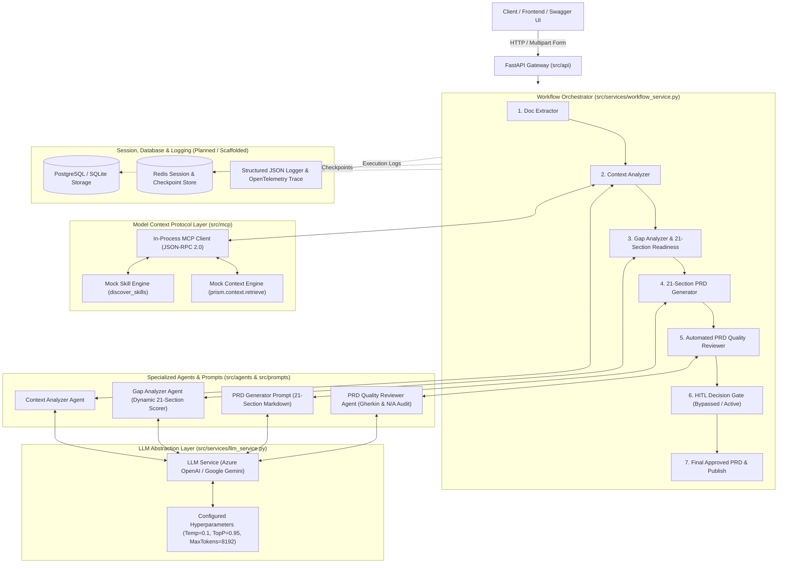

# Backend Framework & Architecture Blueprint

## 1. Executive Architecture Overview

The **Agentic AI Backend** is an enterprise-grade, asynchronous AI orchestration engine engineered to ingest unstructured business context (BRDs, specs, meeting notes) and transform them into **21-section, C-level executive Product Requirements Documents (PRDs)**.

The architecture strictly adheres to decoupled layer boundaries:
- **API Transport Layer**: FastAPI routers handling HTTP lifecycle, validation, and streaming.
- **Workflow Orchestrator Layer**: State machine managing the 7-step Agent Journey and flowchart state transitions.
- **MCP Client & Engine Layer**: JSON-RPC 2.0 Model Context Protocol for dynamic skill discovery and enterprise signal retrieval.
- **Specialized Agent Layer**: Domain-expert agents (Context Analyzer, Gap Analyzer, PRD Generator, PRD Quality Reviewer, HITL, Publisher).
- **LLM Abstraction Layer**: Multi-provider resilience (Azure OpenAI, Google Gemini) with production hyperparameter control.
- **Storage, Session & Observability Foundation**: Dedicated hooks for SQL persistence, Redis state stores, and structured JSON telemetry.

---

## 2. System Architecture Diagram



---

## 3. Directory & Code Structure

```
backend/
├── src/
│   ├── api/                           # Transport Layer (HTTP Endpoints & DTOs)
│   │   ├── __init__.py
│   │   ├── context_api.py             # Single-document context analysis endpoint
│   │   ├── prd_api.py                 # Direct PRD generation endpoint
│   │   ├── workflow_api.py            # End-to-End upload-and-run, HITL review, session queries
│   │   └── gap_api.py                 # (Optional) Standalone gap analysis endpoint
│   │
│   ├── agents/                        # Agent Logic & Evaluation Prompts
│   │   ├── __init__.py
│   │   ├── context_analyzer.py        # Entity & intent classifier
│   │   ├── gap_analyzer.py            # Dynamic 21-section readiness matrix & conflict evaluator
│   │   ├── prd_generator.py           # Markdown prompt assembly
│   │   └── prd_reviewer.py            # Automated QC scoring against 21 headings & acceptance criteria
│   │
│   ├── prompts/                       # Canonical Prompt Templates
│   │   ├── __init__.py
│   │   ├── context_prompt.py          # Context extraction prompt
│   │   └── prd_generator_prompt.py    # Executive 21-section PRD Markdown prompt
│   │
│   ├── services/                      # Business & Orchestration Services
│   │   ├── __init__.py
│   │   ├── document_extractor_service.py # PDF, DOCX, TXT, MD text parsing
│   │   ├── context_service.py         # MCP integration & context package assembly
│   │   ├── gap_analyzer_service.py    # Evidence sufficiency analysis
│   │   ├── prd_service.py             # 100% LLM-driven PRD synthesis (Zero static fallbacks)
│   │   ├── prd_reviewer_service.py    # Review loop execution
│   │   ├── hitl_service.py            # Human-In-The-Loop approval/rejection handler
│   │   ├── publish_service.py         # Jira epic & Confluence page publisher
│   │   ├── workflow_service.py        # Master 7-step Workflow Orchestrator
│   │   └── llm_service.py             # Azure OpenAI & Google Gemini client abstraction
│   │
│   ├── mcp/                           # Model Context Protocol (JSON-RPC 2.0)
│   │   ├── __init__.py
│   │   ├── client.py                  # In-process JSON-RPC 2.0 client
│   │   ├── schemas.py                 # Request / Response JSON-RPC schemas
│   │   ├── mock_skill_engine.py       # Skills registry (discover_skills)
│   │   └── mock_context_engine.py     # Signal & reference retriever (prism.context.retrieve)
│   │
│   ├── schemas/                       # Pydantic Request/Response Models
│   │   ├── __init__.py
│   │   ├── context_response.py
│   │   ├── gap_response.py
│   │   ├── prd_request.py
│   │   └── prd_response.py
│   │
│   ├── db/                            # [PLANNED] Database & Persistence Layer
│   │   ├── __init__.py
│   │   ├── session.py                 # SQLAlchemy / SQLModel engine and sessionmaker
│   │   ├── models/                    # Database entity tables
│   │   │   ├── session_record.py      # Workflow sessions & state snapshots
│   │   │   ├── document_artifact.py   # Uploaded and generated file metadata
│   │   │   └── prd_version.py         # Versioned PRDs & revision history
│   │   └── repositories/              # DB access layer / CRUD operations
│   │
│   ├── logging/                       # [PLANNED] Structured Logging & Observability
│   │   ├── __init__.py
│   │   ├── json_logger.py             # Structured JSON stdout logger (ELK / CloudWatch)
│   │   ├── telemetry.py               # OpenTelemetry spans for Agent execution nodes
│   │   └── audit_trail.py             # Compliance audit log for HITL reviews and publish actions
│   │
│   ├── constants.py                   # Global constants and upload paths
│   ├── config.py                      # Pydantic Settings & LLM hyperparameter defaults
│   └── main.py                        # FastAPI Application Entrypoint
│
├── sample_data/                       # Sample test BRDs (FinOps, KYC, Checkout, Logistics)
├── artifacts/                         # Generated PRD markdown and JSON snapshots
├── tests/                             # Pytest test suite (E2E, MCP, Unit)
├── run_e2e_test.py                    # Standalone E2E verification script
└── prd_output.md                      # Canonical PRD output file
```

---

## 4. API Catalog

| Method | Endpoint | Description | Request Body / Params |
| :--- | :--- | :--- | :--- |
| `POST` | `/api/workflow/upload-and-run` | **End-to-End Agent Workflow**: Ingests document, discovers MCP skills, checks 21-section readiness, generates PRD via LLM, performs QC, and publishes. | `file` (UploadFile), `active_team_id`, `auto_approve_hitl`, `target_publish_platform` |
| `POST` | `/api/workflow/hitl/review` | **Human-In-The-Loop Review**: Submits approval or requests revision on paused PRD drafts. | `{ session_id, decision: "approve"|"request_changes", comments }` |
| `GET` | `/api/workflow/sessions/{session_id}` | **Session Inspection**: Retrieves full execution trajectory, step timestamps, gap reports, and final PRD. | Path param: `session_id` |
| `POST` | `/context/analyze` | **Context Extractor**: Parses document text and returns intent and key entities. | `file` (UploadFile) |
| `POST` | `/prd/generate` | **Direct PRD Generator**: Synthesizes 21-section PRD directly from structured JSON context. | `{ context: {...} }` |

---

## 5. Model Context Protocol (MCP) Integration

The backend implements the **JSON-RPC 2.0** Model Context Protocol specification:

1. **Skill Discovery (`discover_skills`)**:
   - Discovers registered capabilities such as `prd_readiness_matrix_evaluator`, `prd_generator`, and `context_brief_generator`.
2. **Signal & Reference Retrieval (`prism.context.retrieve`)**:
   - Queries enterprise domain context based on document signals (FinOps, Checkout, Logistics, Identity).
   - Injects linked Jira epics, Confluence architecture standards, and Git code references into Section XXI of the PRD.

---

## 6. Specialized Agent Registry

| Agent Name | Primary Responsibility | Output Artifact |
| :--- | :--- | :--- |
| **Doc Extractor** | Parses raw multi-format files (.md, .txt, .pdf, .docx). | Raw text stream & character metadata. |
| **Context Analyzer** | Classifies business intent, extracts title, and interacts with MCP client. | Context Package (Entities, Signals, References). |
| **Gap Analyzer** | Evaluates document completeness across all 21 PRD sections and derives dynamic domain assumptions. | Sufficiency score, Readiness matrix %, Identified Gaps. |
| **PRD Generator** | Pure LLM synthesis of executive 21-section PRD in Markdown with Mermaid diagrams and Given-When-Then criteria. | 21-Section Markdown PRD Document. |
| **PRD Quality Reviewer** | Performs automated QC verifying 21 headings, N/A compliance, and acceptance criteria. | Quality score ($\ge 80$), Pass/Fail verdict, Revision directives. |
| **HITL Reviewer** | Manages Product Owner / BA sign-off (with support for auto-bypass in POC mode). | Human approval audit record. |
| **Publisher** | Generates mock Jira Epics and Confluence documentation spaces. | Publication receipt & URLs. |

---

## 7. Database, Session & Logging Architecture Plan

### A. Database Persistence Plan (`src/db/`)
- **Engine**: Async SQLAlchemy / SQLModel with SQLite (local development) or PostgreSQL (production).
- **Entities**:
  - `WorkflowSession`: `id`, `document_name`, `status`, `created_at`, `updated_at`.
  - `ExecutionStep`: `id`, `session_id`, `node_name`, `status`, `duration_ms`, `step_payload_json`.
  - `PRDArtifact`: `id`, `session_id`, `version_number`, `markdown_content`, `readiness_score`, `quality_score`.

### B. Session & State Management Plan
- **In-Memory Cache (Current)**: Fast dict-based session tracking for rapid local prototyping and test runs.
- **Redis State Store (Target)**: Distributed state checkpoints enabling LangGraph pause/resume workflows across multi-instance deployments.

### C. Logging & Observability Plan (`src/logging/`)
- **Structured JSON Logs**: Formatted for automated ingestion by ELK, Datadog, or Azure Application Insights.
- **OpenTelemetry Tracing**: Distributed tracing spanning from HTTP request ingress through LLM API latency and MCP round-trips.
