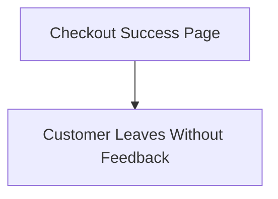
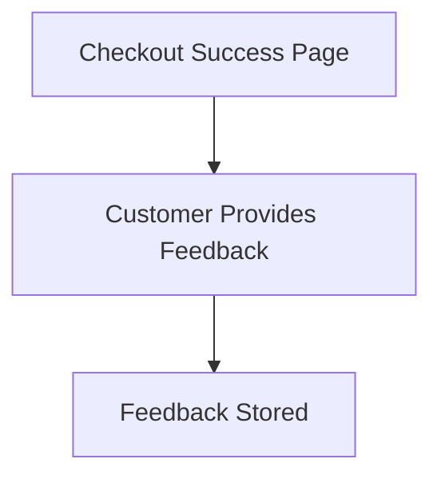

# Product Requirements Document: string

---

## I. Problem Statement
- **Problem**: Customers cannot submit quick feedback on checkout success page.
- **Root Cause**: Lack of a feedback mechanism on the checkout success page.
- **Affected Users**: Customers, Business Analysts
- **Urgency & Timing**: High

## II. Impact of Problem
- **Quantified Impact**: Potential decrease in customer satisfaction and feedback collection.
- **Operational / Financial Cost**: N/A - Not specified in source input
- **Risks of Inaction**: Loss of valuable customer feedback and insights.

## III. Problem Area Process Map
Currently, customers complete their purchase without the ability to provide feedback.

### Identified Bottlenecks:
- No feedback collection mechanism in place.



## IV. What is Needed to Fix the Problem
### Core Capabilities Needed:
- 5-star rating widget implementation

- **Boundary Conditions**: The widget must not significantly impact page load times.

## V. Customer and 3rd Party Research
- **Customer Feedback**: N/A - Not specified in source input
- **3rd Party Research**: N/A - Not specified in source input
- **Analyst Insights**: N/A - Not specified in source input

## VI. Supporting Data
### Telemetry & Baseline Metrics:
- N/A - Not specified in source input

## VII. Solution Discovery, Recommendation, Teams Involved + Sizing
- **Recommended Solution**: Implement a 5-star rating widget on the checkout success page.
- **Teams Involved**: Product Team, Development Team, UX/UI Team
- **Estimated Sizing**: N/A - Not specified in source input

## VIII. Functional and Technical Design
- **System Architecture**: N/A - Not specified in source input

```mermaid
N/A - Not specified in source input
```

### Non-Functional Requirements (NFRs):
- **Performance / Latency**: All String APIs must return responses within 100ms.
- **Availability & SLA**: N/A - Not specified in source input
- **Security & Compliance**: N/A - Not specified in source input

## IX. To Be Process Map
Customers will be able to provide feedback immediately after checkout.



## X. Impact Assessment / Opportunity / Metrics
- **North Star Metric**: Increase in customer feedback submissions.
- **ROI & Opportunity**: N/A - Not specified in source input

### Target KPIs:
- N/A - Not specified in source input

## XI. Development Approach, High Level Requirements, + Epic Breakdown
### Release Phasing:
- **MVP Scope**: 5-star rating widget on checkout success page
- **Out of Scope**: Feedback collection beyond checkout success page

### Epic & User Story Breakdown:
#### Implement Feedback Widget
- **User Story**: As a customer, I want to provide feedback on my checkout experience.
- **Acceptance Criteria**:
  - Given I am on the checkout success page, When I see the 5-star rating widget, Then I can submit my feedback.

## XII. Open Questions and Decision Log
### Decisions Made:
- **Decision**: N/A - Not specified in source input (Rationale: Standard design)

### Open Questions:
- Need confirmation of target volume and latency SLAs for String.

## XIII. Roster
### Project Team & RACI:
- Product Manager
- Developers
- UX Designers

## XIV. Market Research
- **Market Size (TAM/SAM/SOM)**: N/A - Not specified in source input
- **Market Trends**: N/A - Not specified in source input

## XV. Competitive Analysis
- **Key Differentiators**: N/A - Not specified in source input

## XVI. Target Personas
- Online Shoppers

## XVII. Messaging & positioning
- **Positioning**: Enhance customer engagement by allowing quick feedback.

## XVIII. Pricing
- **Pricing Model**: N/A - Not specified in source input
- **Tier Breakdown**: N/A - Not specified in source input

## XIX. Distribution channels & launch activities
- **Launch Phases**: Development, Testing, Deployment
- **Enablement Plan**: N/A - Not specified in source input

## XX. Support plan
- **Escalation Path**: N/A - Not specified in source input
- **Runbooks & Training**: N/A - Not specified in source input

## XXI. Reference materials
- {'title': 'String Foundation PRD', 'link': 'https://confluence.corp.internal/display/S/String+Foundation+PRD'}
- {'title': 'Deliver String capability enhancements', 'link': 'https://jira.corp.internal/browse/S-100'}
- {'title': 'String Architecture and API Standards', 'link': 'https://confluence.corp.internal/display/S/Standards'}
- {'title': 'StringManager.java', 'link': 'https://git.corp.internal/string-service/blob/main/src/core/StringManager.java'}