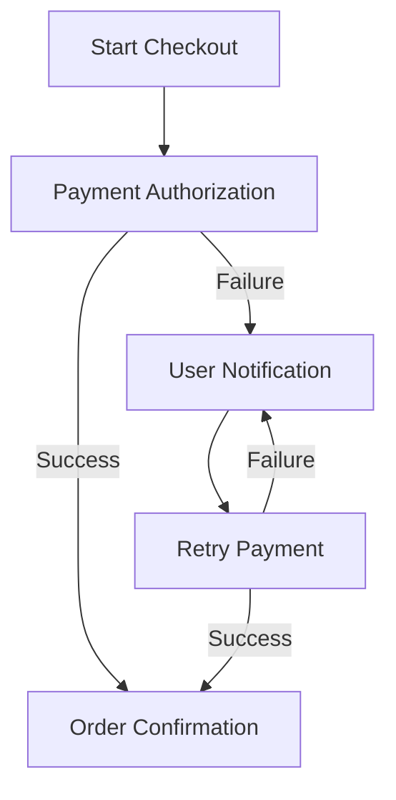
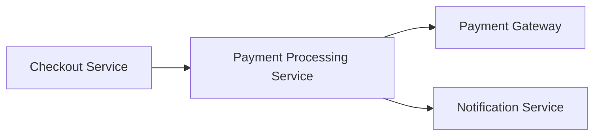
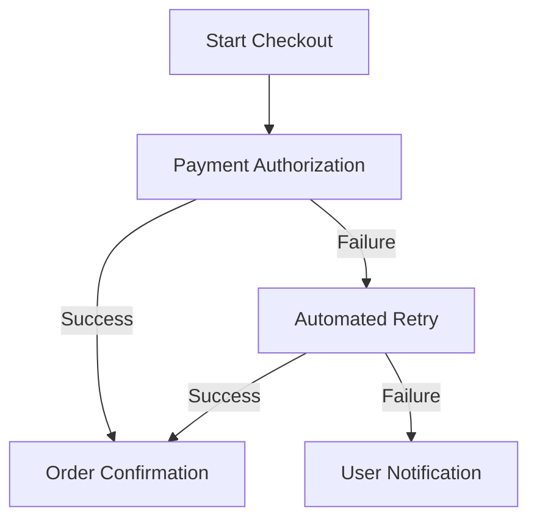

# Product Requirements Document: Checkout Payment Retry Mechanism

---

## I. Problem Statement
- **Problem**: The current checkout payment process experiences high failure rates, leading to increased customer frustration and abandoned transactions.
- **Root Cause**: N/A - Not specified in source input
- **Affected Users**: Online shoppers, Customer support representatives
- **Urgency & Timing**: There is a pressing need to enhance the payment retry mechanism to improve customer experience and reduce transaction abandonment.

## II. Impact of Problem
- **Quantified Impact**: Expected to reduce payment retry failures by 30% within the next quarter.
- **Operational / Financial Cost**: N/A - Not specified in source input
- **Risks of Inaction**: Continued high failure rates will lead to increased customer dissatisfaction, loss of sales, and potential damage to brand reputation.

## III. Problem Area Process Map
The current payment process involves multiple steps where failures can occur, including payment authorization, processing, and confirmation. Each failure leads to customer frustration and potential abandonment of the transaction.

### Identified Bottlenecks:
- High failure rates during payment authorization.
- Lack of effective user notifications during payment failures.

## IV. What is Needed to Fix the Problem
### Core Capabilities Needed:
- Implement a robust payment retry mechanism.
- Enhance user notifications during payment failures.

- **Boundary Conditions**: Need confirmation of target volume and latency SLAs for String.

## V. Customer and 3rd Party Research
- **Customer Feedback**: N/A - Not specified in source input
- **3rd Party Research**: N/A - Not specified in source input
- **Analyst Insights**: N/A - Not specified in source input

## VI. Supporting Data
### Telemetry & Baseline Metrics:
- N/A - Not specified in source input

## VII. Solution Discovery, Recommendation, Teams Involved + Sizing
- **Recommended Solution**: Develop and implement a payment retry mechanism that automatically retries failed transactions and provides real-time notifications to users.
- **Teams Involved**: Engineering, Product, QA, Customer Support
- **Estimated Sizing**: N/A - Not specified in source input

## VIII. Functional and Technical Design
- **System Architecture**: The architecture will include a payment processing service that integrates with existing checkout systems and provides retry capabilities.

### Non-Functional Requirements (NFRs):
- **Performance / Latency**: Payment retries must complete within 2 seconds.
- **Availability & SLA**: 99.9% uptime target.
- **Security & Compliance**: Must comply with PCI DSS standards for payment processing.

## IX. To Be Process Map
The future state will include an automated payment retry mechanism that seamlessly retries failed payments and notifies users of the status, significantly reducing abandonment rates.

## X. Impact Assessment / Opportunity / Metrics
- **North Star Metric**: Reduction in payment retry failures.
- **ROI & Opportunity**: Improved customer satisfaction and increased sales conversion rates.

### Target KPIs:
- **Payment Retry Success Rate**: Baseline = 70% | Target = 90%

## XI. Development Approach, High Level Requirements, + Epic Breakdown
### Release Phasing:
- **MVP Scope**: Implement payment retry mechanism and user notifications.
- **Out of Scope**: Changes to the overall checkout UI, Integration with third-party payment processors.

### Epic & User Story Breakdown:
#### Payment Retry Mechanism
- **User Story**: As an online shopper, I want the system to automatically retry my payment so that I can complete my purchase without manual intervention.
- **Acceptance Criteria**:
  - Given a payment failure
  - When the retry mechanism is triggered
  - Then the payment should be retried automatically.

## XII. Open Questions and Decision Log
### Decisions Made:
- **Decision**: Implement automated payment retries (Rationale: To reduce customer frustration and transaction abandonment).

### Open Questions:
- **Question**: What are the target volume and latency SLAs for String? | Owner: Product Team

## XIII. Roster
### Project Team & RACI:
- **Product Owner**: [Role/Owner]
- **Technical Lead**: [Role/Owner]
- **QA / SRE**: [Role/Owner]

## XIV. Market Research
- **Market Size (TAM/SAM/SOM)**: N/A - Not specified in source input
- **Market Trends**: N/A - Not specified in source input

## XV. Competitive Analysis
- **Key Differentiators**: N/A - Not specified in source input

## XVI. Target Personas
- **Online Shopper**: Goals: Complete purchases easily | Pain Points: Frustration with payment failures.

## XVII. Messaging & positioning
- **Positioning**: A seamless checkout experience with reliable payment processing.
- **Value Pillars**: Enhanced customer satisfaction, reduced transaction abandonment.

## XVIII. Pricing
- **Pricing Model**: N/A - Not specified in source input
- **Tier Breakdown**: N/A - Not specified in source input

## XIX. Distribution channels & launch activities
- **Launch Phases**: Alpha/Beta/GA phases
- **Enablement Plan**: Runbooks, documentation, training for customer support.

## XX. Support plan
- **Escalation Path**: Tier 1 -> Tier 2 -> Tier 3 engineering
- **Runbooks & Training**: Operational monitoring and procedures for payment retries.

## XXI. Reference materials
- [String Foundation PRD](https://confluence.corp.internal/display/S/String+Foundation+PRD)
- [Deliver String capability enhancements](https://jira.corp.internal/browse/S-100)
- [String Architecture and API Standards](https://confluence.corp.internal/display/S/Standards)
- [Core domain code handler in Git](https://git.corp.internal/string-service/blob/main/src/core/StringManager.java)

---