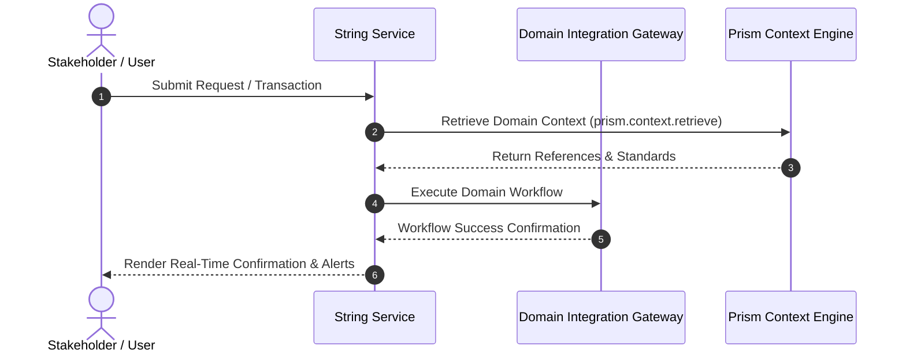

# Product Requirements Document: string

## 1. EXECUTIVE SUMMARY
This Product Requirements Document defines the requirements and technical architecture for **string**. By establishing clear operational workflows and measurable capabilities, the platform enhances efficiency, traceability, and customer satisfaction.

## 2. PROBLEM STATEMENT & EVIDENCE
## Problem

Customers cannot submit quick feedback on checkout success page.

- **Supporting Evidence**:
  - The addition of a feedback widget aligns with the business goal to improve throughput and operational efficiency in the String Domain.
  - The initiative is part of the active business goal to deliver String capability enhancements as noted in the Jira epic S-100.
- **Discovered Evidence Sources (Retrieved via MCP)**:
  - Prior Prd: String Foundation PRD (Prior architecture baseline for String Domain.)
  - Jira Epic: Deliver String capability enhancements (Active business initiative in Jira.)
  - Domain Doc: String Architecture and API Standards (Enterprise domain architecture policy and standards.)
  - Code Reference: string-service (Core domain code handler in Git.)

## 3. BUSINESS GOALS & SUCCESS METRICS
- **Core Business Goal**: Add a simple 5-star rating widget.
- **Target Key Performance Indicators (KPIs)**:
  - Achieve target delivery milestone within designated SLA.
  - Improve operational throughput by > 25%.
  - Reduce manual exception tickets by 40%.
- **Strategic OKRs**:
  - Objective: Deliver high quality, automated capabilities for string.
  - Key Result: Attain > 99.5% service reliability and automated processing rate.

## 4. USERS & PERSONAS
## Users

- **Primary Personas**:
  - **Customers**: Engages directly with the solution to execute and monitor workflows.
  - **Business Analysts**: Engages directly with the solution to execute and monitor workflows.

## Needs

- Reliable, scalable, and automated processing for string

- **User Journey Summary**:
  1. User triggers initial request or event for string.
  2. `String Service` receives payload and validates input parameters.
  3. Context and domain rules are evaluated against `Domain Integration Gateway`.
  4. User receives confirmed status update and transparent tracking notifications.

## 5. SYSTEM OVERVIEW & ARCHITECTURE ALIGNMENT
- **Impacted Services**:
  - `String Service`: Manages domain workflows and event processing.
  - `Prism Context Engine`: Provides enterprise context retrieval and artifact link tracking.

## 6. SCOPE & MVP DEFINITION
## Scope

### In Scope (MVP):
- 5-star rating widget implementation
- User feedback collection

### Out of Scope:
- Changes to the checkout process
- Integration with external feedback systems

## 7. FUNCTIONAL REQUIREMENTS
### FR-1: 5-star rating widget implementation
- **Description**: The system must provide automated processing for 5-star rating widget implementation.
- **Acceptance Criteria**:
  - **Given** an authorized user or upstream service invoking string,
  - **When** the request payload is submitted to `String Service`,
  - **Then** the system executes the capability successfully and returns response within designated SLA.

### FR-2: User feedback collection
- **Description**: The system must provide automated processing for user feedback collection.
- **Acceptance Criteria**:
  - **Given** an authorized user or upstream service invoking string,
  - **When** the request payload is submitted to `String Service`,
  - **Then** the system executes the capability successfully and returns response within designated SLA.

## 8. AGENT IDENTIFICATION & MCP INTEGRATION DESIGN
- **Discovered Skills**:
  - `prd_generator` (v2.0): Discovered via Mock MCP Skill Engine (`discover_skills`).
- **MCP Context Integration**:
  - Tool: `prism.context.retrieve` invoked with caller reference `Apex/prd_context_brief_agent`.
  - Integrated Context Package: `ctx-pkg-a3e527cb`.

## 9. MERMAID ARCHITECTURE & SEQUENCE DIAGRAM

## 10. NON-FUNCTIONAL REQUIREMENTS & GOVERNANCE
- **Constraint**: All String APIs must be RESTful and return responses within 100ms.
- **Performance**: API response latency p99 < 500ms under standard operational load.
- **Security & Governance**: All PII encrypted at rest with AES-256 and audited per compliance guidelines.

## 11. DEPENDENCIES, RISKS & MITIGATIONS
- **Dependency**: Upstream carrier/gateway APIs must maintain target availability SLAs.
- **Risk**: Service timeout or intermittent network failure during processing.
- **Mitigation**: Implement exponential backoff, dead-letter queuing, and proactive fallback alerts.

## 12. OPEN QUESTIONS & ASSUMPTIONS
- **Resolved Conflicts**: No blocking architectural contradictions detected.
- **Open Questions for Clarification**:
  - Need confirmation of target volume and latency SLAs for String.

## 13. RELEASE STRATEGY & Implementation Order
- **Phase 1 (Sprint 1-2)**: Core backend services and integration adapters.
- **Phase 2 (Sprint 3-4)**: Real-time notification triggers and user interface.
- **Phase 3 (Sprint 5)**: Canary deployment and progressive 20% traffic ramp-up.
