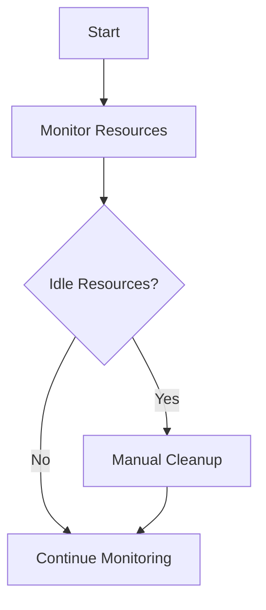
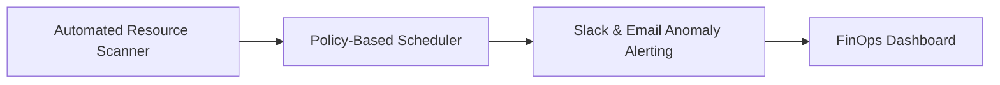
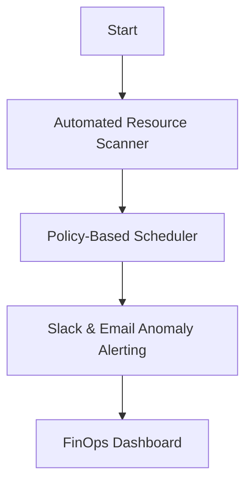

# Product Requirements Document: string

---

## I. Problem Statement
- **Problem**: Cloud infrastructure expenditure across AWS and Kubernetes environments has grown by 65% year-over-year, with an estimated $120,000 monthly wasted on unattached EBS volumes, oversized non-production database instances, and idle staging clusters left running over weekends.
- **Root Cause**: Inefficient resource utilization and lack of automated cost management.
- **Affected Users**: Engineering Team Leads, Site Reliability Engineers (SREs), Cloud Operations Manager, Chief Financial Officer (CFO).
- **Urgency & Timing**: High - Immediate action required to prevent further financial waste.

## II. Impact of Problem
- **Quantified Impact**: Estimated $120,000 monthly wasted.
- **Operational / Financial Cost**: Increased operational costs due to inefficient resource usage.
- **Risks of Inaction**: Continued financial waste and potential budget overruns.

## III. Problem Area Process Map
Current processes lack automation for resource management, leading to idle resources and unnecessary costs.

### Identified Bottlenecks:
- Manual monitoring of resource usage.
- Delayed response to cost anomalies.

## IV. What is Needed to Fix the Problem
### Core Capabilities Needed:
- Automated resource scanning
- Policy-based scheduling
- Real-time anomaly detection

- **Boundary Conditions**: Production workloads must never be modified or stopped by automated remediation policies.

## V. Customer and 3rd Party Research
- **Customer Feedback**: N/A - Not specified in source input
- **3rd Party Research**: N/A - Not specified in source input
- **Analyst Insights**: N/A - Not specified in source input

## VI. Supporting Data
### Telemetry & Baseline Metrics:
- Non-production cluster utilization averages only 14% on weekends.

## VII. Solution Discovery, Recommendation, Teams Involved + Sizing
- **Recommended Solution**: Implement an Automated Cloud Cost Optimizer with FinOps governance.
- **Teams Involved**: Engineering Team, Cloud Operations Team, Finance Team
- **Estimated Sizing**: N/A - Not specified in source input

## VIII. Functional and Technical Design
- **System Architecture**: N/A - Not specified in source input

### Non-Functional Requirements (NFRs):
- **Performance / Latency**: Real-time alerts within 15 minutes.
- **Availability & SLA**: N/A - Not specified in source input
- **Security & Compliance**: N/A - Not specified in source input

## IX. To Be Process Map
Automated processes for resource management and cost optimization.

## X. Impact Assessment / Opportunity / Metrics
- **North Star Metric**: Monthly savings of at least $30,000.
- **ROI & Opportunity**: N/A - Not specified in source input

### Target KPIs:
- N/A - Not specified in source input

## XI. Development Approach, High Level Requirements, + Epic Breakdown
### Release Phasing:
- **MVP Scope**: Automated Resource Scanner, Policy-Based Scheduler
- **Out of Scope**: Production workload modifications

### Epic & User Story Breakdown:
#### Automated Resource Management
- **User Story**: As an SRE, I want to receive alerts for cost anomalies so that I can take action quickly.
- **Acceptance Criteria**:
  - Given a cost anomaly occurs, When the threshold is exceeded, Then an alert is sent within 15 minutes.

## XII. Open Questions and Decision Log
### Decisions Made:
- **Decision**: N/A - Not specified in source input (Rationale: Standard design)

### Open Questions:
- N/A - Not specified in source input

## XIII. Roster
### Project Team & RACI:
- Engineering Team
- Cloud Operations Team
- Finance Team

## XIV. Market Research
- **Market Size (TAM/SAM/SOM)**: N/A - Not specified in source input
- **Market Trends**: N/A - Not specified in source input

## XV. Competitive Analysis
- **Key Differentiators**: N/A - Not specified in source input

## XVI. Target Personas
- Engineering Team Leads
- Site Reliability Engineers (SREs)
- Cloud Operations Manager
- Chief Financial Officer (CFO)

## XVII. Messaging & positioning
- **Positioning**: Automated Cloud Cost Optimizer provides real-time insights and actions to reduce cloud expenditure.

## XVIII. Pricing
- **Pricing Model**: N/A - Not specified in source input
- **Tier Breakdown**: N/A - Not specified in source input

## XIX. Distribution channels & launch activities
- **Launch Phases**: MVP launch, Post-MVP feature rollout
- **Enablement Plan**: N/A - Not specified in source input

## XX. Support plan
- **Escalation Path**: N/A - Not specified in source input
- **Runbooks & Training**: N/A - Not specified in source input

## XXI. Reference materials
- https://confluence.corp.internal/display/S/String+Foundation+PRD
- https://jira.corp.internal/browse/S-100
- https://confluence.corp.internal/display/S/Standards
- https://git.corp.internal/string-service/blob/main/src/core/StringManager.java