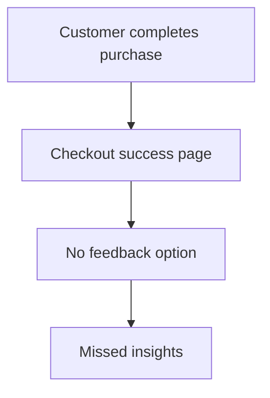
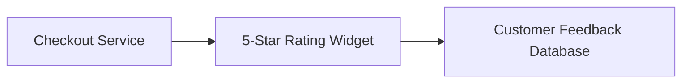
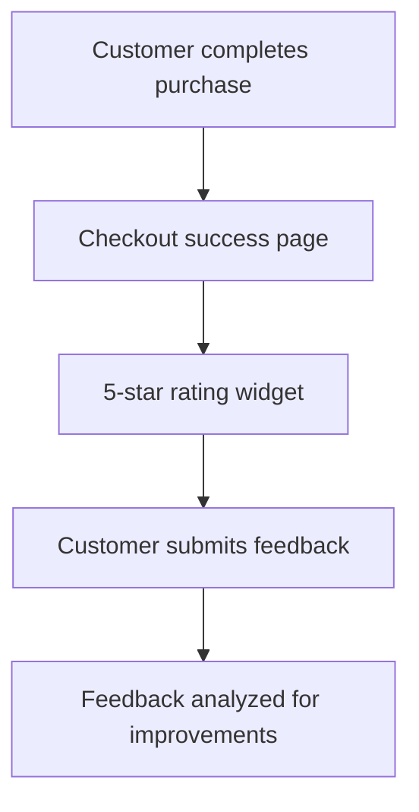

# Product Requirements Document: Customer Feedback Widget

---

## I. Problem Statement
- **Problem**: Customers cannot submit quick feedback on the checkout success page.
- **Root Cause**: N/A - Not specified in source input
- **Affected Users**: Customers, Business Analysts
- **Urgency & Timing**: The addition of a feedback widget aligns with the business goal to improve throughput and operational efficiency in the String Domain.

## II. Impact of Problem
- **Quantified Impact**: The inability to collect customer feedback may lead to decreased customer satisfaction and missed opportunities for improvement.
- **Operational / Financial Cost**: N/A - Not specified in source input
- **Risks of Inaction**: Without a feedback mechanism, the company risks losing valuable insights into customer experiences, which could hinder future enhancements and operational efficiency.

## III. Problem Area Process Map
Currently, customers complete their purchase but have no means to provide immediate feedback on their experience, leading to missed opportunities for improvement.

### Identified Bottlenecks:
- Lack of a feedback mechanism on the checkout success page.
- Delayed insights into customer satisfaction.

## IV. What is Needed to Fix the Problem
### Core Capabilities Needed:
- Implementation of a 5-star rating widget.
- Integration of the widget with the checkout success page.

- **Boundary Conditions**: All String APIs must be RESTful and return responses within 100ms.

## V. Customer and 3rd Party Research
- **Customer Feedback**: N/A - Not specified in source input
- **3rd Party Research**: N/A - Not specified in source input
- **Analyst Insights**: N/A - Not specified in source input

## VI. Supporting Data
### Telemetry & Baseline Metrics:
- N/A - Not specified in source input

## VII. Solution Discovery, Recommendation, Teams Involved + Sizing
- **Recommended Solution**: Develop and integrate a 5-star rating widget on the checkout success page to enable quick customer feedback.
- **Teams Involved**: Engineering, Product, QA
- **Estimated Sizing**: N/A - Not specified in source input

## VIII. Functional and Technical Design
- **System Architecture**: The architecture will include the integration of the feedback widget with existing checkout services.

### Non-Functional Requirements (NFRs):
- **Performance / Latency**: The widget must load within 100ms.
- **Availability & SLA**: Uptime targets to be defined.
- **Security & Compliance**: Must comply with data protection regulations and ensure secure transmission of feedback data.

## IX. To Be Process Map
In the future state, customers will be able to provide immediate feedback via a 5-star rating widget on the checkout success page, allowing for real-time insights into customer satisfaction.

## X. Impact Assessment / Opportunity / Metrics
- **North Star Metric**: Increase in customer feedback submissions post-purchase.
- **ROI & Opportunity**: Expected improvement in customer satisfaction and operational efficiency.

### Target KPIs:
- **Feedback Submission Rate**: Baseline = 0% | Target = 20%

## XI. Development Approach, High Level Requirements, + Epic Breakdown
### Release Phasing:
- **MVP Scope**: Implementation of the 5-star rating widget and integration with the checkout success page.
- **Out of Scope**: Feedback analysis and reporting.

### Epic & User Story Breakdown:
#### Epic 1: Feedback Widget Implementation
- **User Story**: As a Customer, I want to submit a quick rating after my purchase so that I can share my experience.
- **Acceptance Criteria**:
  - Given I am on the checkout success page,
  - When I see the 5-star rating widget,
  - Then I can submit my rating successfully.

## XII. Open Questions and Decision Log
### Decisions Made:
- **Decision**: Implement a 5-star rating widget on the checkout success page (Rationale: To enable quick customer feedback).

### Open Questions:
- **Question**: What is the target volume and latency SLAs for String? | Owner: Product Team

## XIII. Roster
### Project Team & RACI:
- **Product Owner**: [Role/Owner]
- **Technical Lead**: [Role/Owner]
- **QA / SRE**: [Role/Owner]

## XIV. Market Research
- **Market Size (TAM/SAM/SOM)**: N/A - Not specified in source input
- **Market Trends**: N/A - Not specified in source input

## XV. Competitive Analysis
- **Key Differentiators**: N/A - Not specified in source input

## XVI. Target Personas
- **Customer**: Goals: Provide feedback easily | Pain Points: Lack of feedback options post-purchase

## XVII. Messaging & positioning
- **Positioning**: A simple and effective way for customers to share their experiences immediately after purchase.
- **Value Pillars**: Quick feedback submission, improved customer satisfaction, enhanced operational insights.

## XVIII. Pricing
- **Pricing Model**: N/A - Not specified in source input
- **Tier Breakdown**: N/A - Not specified in source input

## XIX. Distribution channels & launch activities
- **Launch Phases**: Alpha/Beta/GA phases to be defined.
- **Enablement Plan**: Documentation and training materials for internal teams.

## XX. Support plan
- **Escalation Path**: Tier 1 -> Tier 2 -> Tier 3 engineering support.
- **Runbooks & Training**: Operational monitoring procedures to be developed.

## XXI. Reference materials
- [String Foundation PRD](https://confluence.corp.internal/display/S/String+Foundation+PRD)
- [Deliver String capability enhancements](https://jira.corp.internal/browse/S-100)
- [String Architecture and API Standards](https://confluence.corp.internal/display/S/Standards)
- [Core domain code handler](https://git.corp.internal/string-service/blob/main/src/core/StringManager.java)

---