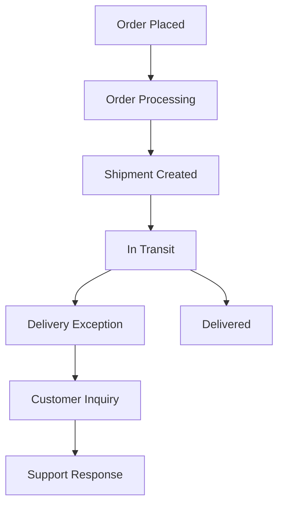
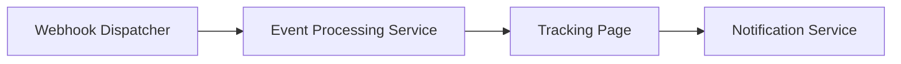
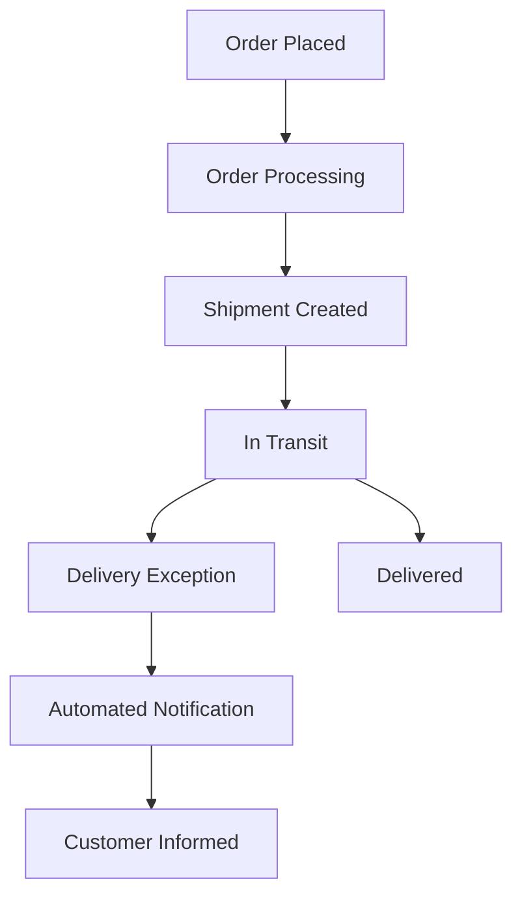

# Product Requirements Document: Real-Time Order Fulfillment and Shipment Tracking

---

## I. Problem Statement
- **Problem**: E-commerce buyers currently receive vague shipment status updates ("In Transit"), resulting in 42% of customer support inquiries ("Where Is My Order?" / WISMO). Furthermore, delivery exceptions and carrier delays are not proactively communicated to customers until after promised delivery dates pass.
- **Root Cause**: N/A - Not specified in source input
- **Affected Users**: Shoppers tracking their online orders, Customer Experience & Logistics Support Specialists
- **Urgency & Timing**: Immediate need to reduce customer support inquiries and improve customer satisfaction.

## II. Impact of Problem
- **Quantified Impact**: Support analytics show WISMO tickets cost $4.20 per contact, totaling over $85,000 monthly in support operational costs.
- **Operational / Financial Cost**: N/A - Not specified in source input
- **Risks of Inaction**: Continued high volume of customer support inquiries leading to increased operational costs and decreased customer satisfaction.

## III. Problem Area Process Map
Currently, customers receive minimal updates on their order status, leading to confusion and frustration. The lack of proactive communication regarding delays or exceptions results in a high volume of inquiries to customer support.

### Identified Bottlenecks:
- Lack of real-time updates on shipment status.
- Delayed communication of delivery exceptions.

## IV. What is Needed to Fix the Problem
### Core Capabilities Needed:
- Multi-carrier webhook ingestion with deduplication and normalized event schemas.
- Automated proactive notifications for shipment milestones and exceptions.

- **Boundary Conditions**: Webhook ingestion throughput must support 5,000 requests/second during peak holiday sales.

## V. Customer and 3rd Party Research
- **Customer Feedback**: N/A - Not specified in source input
- **3rd Party Research**: N/A - Not specified in source input
- **Analyst Insights**: N/A - Not specified in source input

## VI. Supporting Data
### Telemetry & Baseline Metrics:
- N/A - Not specified in source input

## VII. Solution Discovery, Recommendation, Teams Involved + Sizing
- **Recommended Solution**: Implement a real-time order tracking system that integrates with multiple carriers to provide timely updates and proactive notifications.
- **Teams Involved**: Engineering, Product Management, Customer Support, QA
- **Estimated Sizing**: N/A - Not specified in source input

## VIII. Functional and Technical Design
- **System Architecture**: The system will consist of a webhook dispatcher for carrier notifications, a tracking page for customers, and a backend service for processing events.

### Non-Functional Requirements (NFRs):
- **Performance / Latency**: Webhook ingestion latency must be under 5 minutes.
- **Availability & SLA**: 99.9% uptime target.
- **Security & Compliance**: Ensure compliance with data protection regulations and secure transmission of data.

## IX. To Be Process Map
In the future state, customers will receive timely updates on their order status through automated notifications, significantly reducing the volume of inquiries to customer support.

## X. Impact Assessment / Opportunity / Metrics
- **North Star Metric**: Reduce WISMO customer support inquiries by 50% within 3 months of launch.
- **ROI & Opportunity**: Expected reduction in operational costs associated with customer support.

### Target KPIs:
- **WISMO Inquiries**: Baseline = 42% | Target = 21%

## XI. Development Approach, High Level Requirements, + Epic Breakdown
### Release Phasing:
- **MVP Scope**: Multi-carrier webhook ingestion, interactive tracking page with dynamic map, automated notifications.
- **Out of Scope**: Integration with carriers not listed (FedEx, UPS, DHL, USPS).

### Epic & User Story Breakdown:
#### Epic 1: Multi-carrier Integration
- **User Story**: As a Shopper, I want to receive real-time updates on my order status so that I can track my shipment effectively.
- **Acceptance Criteria**:
  - Given an order is placed,
  - When the shipment status changes,
  - Then the customer receives an automated notification.

## XII. Open Questions and Decision Log
### Decisions Made:
- **Decision**: Implement multi-carrier webhook ingestion (Rationale: To provide real-time updates).

### Open Questions:
- **Question**: What are the specific latency SLAs for each carrier? | Owner: Logistics Team

## XIII. Roster
### Project Team & RACI:
- **Product Owner**: [Role/Owner]
- **Technical Lead**: [Role/Owner]
- **QA / SRE**: [Role/Owner]

## XIV. Market Research
- **Market Size (TAM/SAM/SOM)**: N/A - Not specified in source input
- **Market Trends**: N/A - Not specified in source input

## XV. Competitive Analysis
- **Key Differentiators**: N/A - Not specified in source input

## XVI. Target Personas
- **Shoppers**: Goals: Track orders easily | Pain Points: Lack of visibility on order status.

## XVII. Messaging & positioning
- **Positioning**: Real-time order tracking that keeps customers informed and reduces support inquiries.
- **Value Pillars**: Transparency, Efficiency, Customer Satisfaction.

## XVIII. Pricing
- **Pricing Model**: N/A - Not specified in source input
- **Tier Breakdown**: N/A - Not specified in source input

## XIX. Distribution channels & launch activities
- **Launch Phases**: Alpha testing with select users, followed by Beta release and General Availability (GA).
- **Enablement Plan**: Documentation for users and training for support staff.

## XX. Support plan
- **Escalation Path**: Tier 1 -> Tier 2 -> Tier 3 engineering.
- **Runbooks & Training**: Operational monitoring procedures and training materials for support staff.

## XXI. Reference materials
- [String Foundation PRD](https://confluence.corp.internal/display/S/String+Foundation+PRD)
- [Deliver String capability enhancements](https://jira.corp.internal/browse/S-100)
- [String Architecture and API Standards](https://confluence.corp.internal/display/S/Standards)
- [Core domain code handler](https://git.corp.internal/string-service/blob/main/src/core/StringManager.java)

---