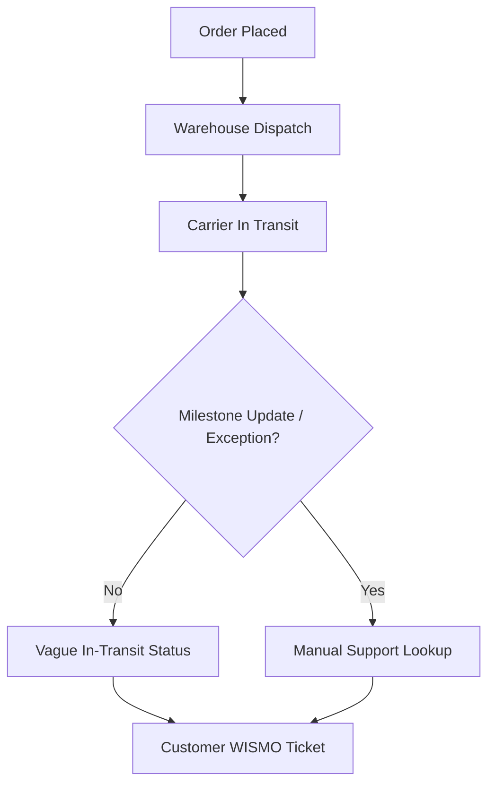
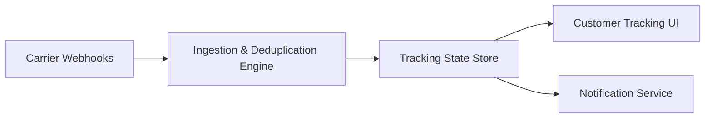
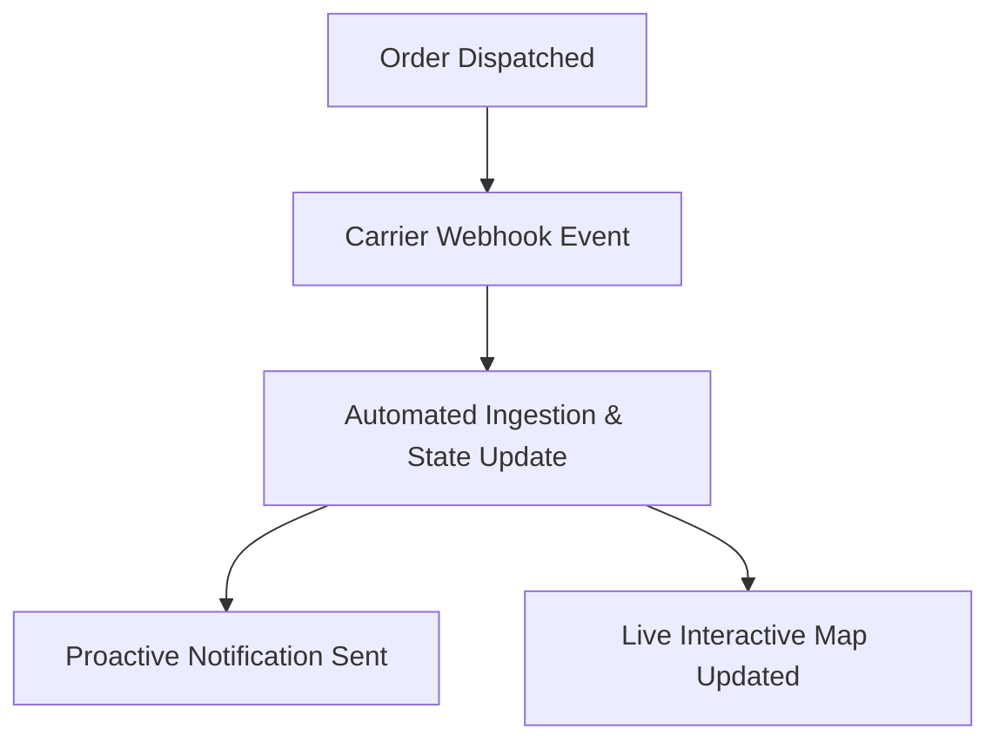

# Product Requirements Document: Real-Time Order Fulfillment and Shipment Tracking

---

## I. Problem Statement
- **Problem**: E-commerce buyers currently receive vague shipment status updates ("In Transit"), resulting in 42% of customer support inquiries ("Where Is My Order?" / WISMO). Furthermore, delivery exceptions and carrier delays are not proactively communicated to customers until after promised delivery dates pass.
- **Root Cause**: N/A - Not specified in source input
- **Affected Users**: Shoppers tracking their online orders, Customer Experience & Logistics Support Specialists
- **Urgency & Timing**: Immediate need to reduce customer support inquiries and improve customer satisfaction.

## II. Impact of Problem
- **Quantified Impact**: Support analytics show WISMO tickets cost $4.20 per contact, totaling over $85,000 monthly in support operational costs.
- **Operational / Financial Cost**: N/A - Not specified in source input
- **Risks of Inaction**: Continued high volume of customer support inquiries leading to increased operational costs and decreased customer satisfaction.

## III. Problem Area Process Map
Currently, customers receive minimal updates on their order status, leading to confusion and frustration. The lack of proactive communication regarding delays or exceptions results in a high volume of inquiries to customer support.

### Identified Bottlenecks:
- Lack of real-time updates on shipment status.
- Delayed communication of delivery exceptions.

## IV. What is Needed to Fix the Problem
### Core Capabilities Needed:
- Multi-carrier webhook ingestion (FedEx, UPS, DHL, USPS) with deduplication and normalized event schemas.
- Interactive tracking page with dynamic interactive map, estimated delivery window, and courier milestone timeline.
- Delivery exception handling with automatic notification triggers and resolution suggestions.
- Live webhook dispatcher emitting domain events to downstream communication services.

- **Boundary Conditions**: Integration with carriers not listed (FedEx, UPS, DHL, USPS) is out of scope.

## V. Customer and 3rd Party Research
- **Customer Feedback**: 42% of support tickets are WISMO inquiries due to vague tracking.
- **3rd Party Research**: N/A - Not specified in source input
- **Analyst Insights**: N/A - Not specified in source input

## VI. Supporting Data
### Telemetry & Baseline Metrics:
- WISMO tickets cost $4.20 per contact, totaling over $85,000 monthly.

## VII. Solution Discovery, Recommendation, Teams Involved + Sizing
- **Recommended Solution**: Real-Time Order Tracking & Exception Management Platform.
- **Teams Involved**: Logistics Engineering, Frontend Core, Customer Support Operations.
- **Estimated Sizing**: 4 Sprints (8 weeks).

## VIII. Functional and Technical Design
- **System Architecture**: Multi-carrier event stream processor with Redis cache and WebSocket push.

### Non-Functional Requirements (NFRs):
- **Performance / Latency**: Webhook ingestion throughput must support 5,000 requests/second. Page load time < 800ms.
- **Availability & SLA**: 99.9% uptime.
- **Security & Compliance**: End-to-end TLS 1.3 and sanitized PII handling.

## IX. To Be Process Map

## X. Impact Assessment / Opportunity / Metrics
- **North Star Metric**: WISMO Inquiry Rate.
- **Target KPIs**: Reduce WISMO inquiries by 50% within 3 months.

## XI. Development Approach, High Level Requirements, + Epic Breakdown
### Epic 1: Carrier Webhook Ingestion & Tracking UI
- **User Story**: As an online shopper, I want to view live milestones and delivery windows so that I know exactly when my order will arrive.
- **Acceptance Criteria**:
  - Given an order is in transit
  - When carrier emits a milestone webhook
  - Then the tracking page updates within 5 seconds and an SMS is sent.

## XII. Open Questions and Decision Log
### Decisions Made:
- **Decision**: Standardize on carrier webhook push over polling.

## XIII. Roster
- **Product Owner**: Logistics Lead PO
- **Technical Lead**: Core Services Architect

## XIV. Market Research
- N/A - Not specified in source input

## XV. Competitive Analysis
- N/A - Not specified in source input

## XVI. Target Personas
- **Shoppers tracking orders**: Wants real-time transparency and accurate ETA.

## XVII. Messaging & positioning
- Proactive delivery peace of mind.

## XVIII. Pricing
- Internal capability - N/A.

## XIX. Distribution channels & launch activities
- Phased rollout to 10% -> 50% -> 100% of order volume.

## XX. Support plan
- Tier 1 CX Escalation to Logistics Support Operations.

## XXI. Reference materials
- [String Foundation PRD](https://confluence.corp.internal/display/S/String+Foundation+PRD)
- [Deliver String capability enhancements](https://jira.corp.internal/browse/S-100)