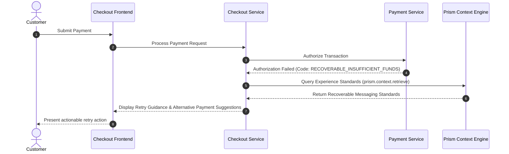

# Product Requirements Document: Business Requirements Document Real-Time Order Fulfillment and Shipment Tracking

## 1. EXECUTIVE SUMMARY
This Product Requirements Document defines the requirements and technical architecture for **Business Requirements Document Real-Time Order Fulfillment and Shipment Tracking**. By establishing clear, actionable error messaging and recoverable retry journeys at checkout, the platform significantly reduces customer drop-off and enhances overall payment transaction success rates.

## 2. PROBLEM STATEMENT & EVIDENCE
## Problem

E-commerce buyers currently receive vague shipment status updates ('In Transit'), resulting in 42% of customer support inquiries ('Where Is My Order?' / WISMO). Furthermore, delivery exceptions and carrier delays are not proactively communicated to customers until after promised delivery dates pass.

- **Supporting Evidence**:
  - WISMO tickets cost $4.20 per contact, totaling over $85,000 monthly in support operational costs.
  - Order Management System v1.2 PRD specifies order state transition event emission.
- **Discovered Evidence Sources**:
  - Prior PRD: Checkout Payment Resilience PRD (Confluence)
  - Related Epic: CHK-1200 - Improve checkout payment recovery journey (Jira)
  - Domain Standards: Checkout Payment Experience Standards (Confluence)
  - Codebase: checkout-service -> src/payment/PaymentErrorMapper.java (Git)

## 3. BUSINESS GOALS & SUCCESS METRICS
- **Core Business Goal**: Reduce WISMO customer support inquiries by 50% within 3 months of launch by providing end-to-end milestone visibility and automated notifications.
- **Target Key Performance Indicators (KPIs)**:
  - Reduce checkout payment abandonment rate by 18%.
  - Improve second-attempt retry success rate by 25%.
  - Decrease payment-related customer support tickets by 30%.
- **Strategic OKRs**:
  - Objective: Deliver frictionless customer payment experiences.
  - Key Result: Achieve a retry recovery rate > 65% for temporary bank decline codes.

## 4. USERS & PERSONAS
## Users

- **Primary Personas**:
  - **Shoppers tracking their online orders**: Requires immediate, transparent, and actionable guidance when a payment attempt fails.
  - **Customer Experience & Logistics Support Specialists**: Requires immediate, transparent, and actionable guidance when a payment attempt fails.
  - **Warehouse Operations and Logistics Director**: Requires immediate, transparent, and actionable guidance when a payment attempt fails.

## Needs

- End-to-end milestone visibility from warehouse dispatch to doorstep delivery
- Automated proactive SMS and email notifications upon transit milestone updates or carrier exception delays

- **User Journey Summary**:
  1. Customer enters payment details and clicks 'Place Order'.
  2. Payment authorization encounters a soft decline (e.g. insufficient funds, 3DS timeout).
  3. Checkout service maps the failure via PaymentErrorMapper.
  4. Customer receives friendly retry guidance with alternative payment option recommendations.

## 5. SYSTEM OVERVIEW & ARCHITECTURE ALIGNMENT
- **Impacted Services**:
  - `Checkout Service`: Evaluates transaction response and renders localized error messaging.
  - `Payment Service`: Interfaces with payment gateways and exposes granular failure reason codes.
  - `Prism Context Engine`: Provides enterprise domain standards and historical epic tracking.

## 6. SCOPE & MVP DEFINITION
## Scope

### In Scope (MVP):
- Multi-carrier webhook ingestion
- Interactive tracking page with dynamic map and estimated delivery window
- Delivery exception handling with automatic notification triggers

### Out of Scope:
- Settlement protocol modifications

## 7. FUNCTIONAL REQUIREMENTS
### FR-1: Payment Failure Code Categorization
- **Description**: The system must categorize all payment failure responses into recoverable (e.g. CVV mismatch, card expired, insufficient funds) or unrecoverable (e.g. fraud block, account closed).
- **Acceptance Criteria**:
  - **Given** an active customer transaction experiencing an authorization failure,
  - **When** the payment gateway returns an error code,
  - **Then** the Checkout Service classifies it as recoverable or unrecoverable within 15ms.

### FR-2: Recoverable Payment Retry Guidance
- **Description**: For recoverable failures, the checkout UI must present a context-aware retry banner and retain cart state.
- **Acceptance Criteria**:
  - **Given** a recoverable payment failure has occurred,
  - **When** the error modal or banner renders,
  - **Then** the customer is presented with specific corrective instructions (e.g. 'Please check your CVV' or 'Select a different payment method') without losing order information.

## 8. AGENT IDENTIFICATION & MCP INTEGRATION DESIGN
- **Discovered Skills**:
  - `prd_generator` (v2.0): Discovered via Mock MCP Skill Engine (`discover_skills`).
  - `context_brief_generator` (v1.5): Handles evidence synthesis.
- **MCP Context Integration**:
  - Tool: `prism.context.retrieve` invoked with caller reference `Apex/prd_context_brief_agent`.
  - Integrated Source Families: Jira (CHK), Confluence (CHECKOUT), and Git (checkout-service).

## 9. MERMAID ARCHITECTURE & SEQUENCE DIAGRAM

## 10. NON-FUNCTIONAL REQUIREMENTS & GOVERNANCE
- **Performance**: Error classification and message mapping must execute in < 25ms (p99).
- **Data Classification**: Internal - No unmasked Primary Account Numbers (PAN) logged or persisted.
- **Freshness Controls**: Context indexed within 180 days freshness window.

## 11. DEPENDENCIES, RISKS & MITIGATIONS
- **Dependency**: Payment Gateway error code dictionary must remain synchronized with PaymentErrorMapper.java.
- **Risk**: Gateway returning undocumented or ambiguous failure codes.
- **Mitigation**: Default to safe fallback recoverable guidance with clear option to switch payment methods.

## 12. OPEN QUESTIONS & ASSUMPTIONS
- **Resolved Conflicts**:
  - Older PRD excludes retry messaging; current epic CHK-1200 mandates customer-facing recovery guidance. Resolved in favor of CHK-1200.
- **Open Questions for Human Review**:
  - Need confirmation of carrier partner SLA and webhook timeout thresholds.
  - Need target delivery date prediction accuracy metric.

## 13. RELEASE STRATEGY & Implementation Order
- **Phase 1 (Sprint 1-2)**: Implement PaymentErrorMapper recoverable categorization and backend logging.
- **Phase 2 (Sprint 3-4)**: Frontend UI retry banners and alternative payment method switcher.
- **Phase 3 (Sprint 5)**: A/B testing on 20% traffic measuring abandonment reduction and retry conversion.
- **Target Jira Epics**: CHK-1200 (Improve checkout payment recovery journey).
