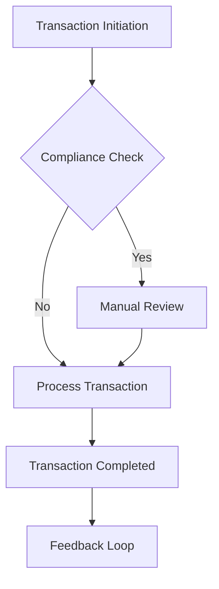
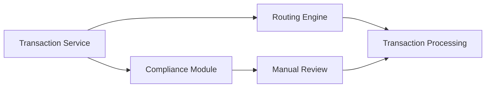
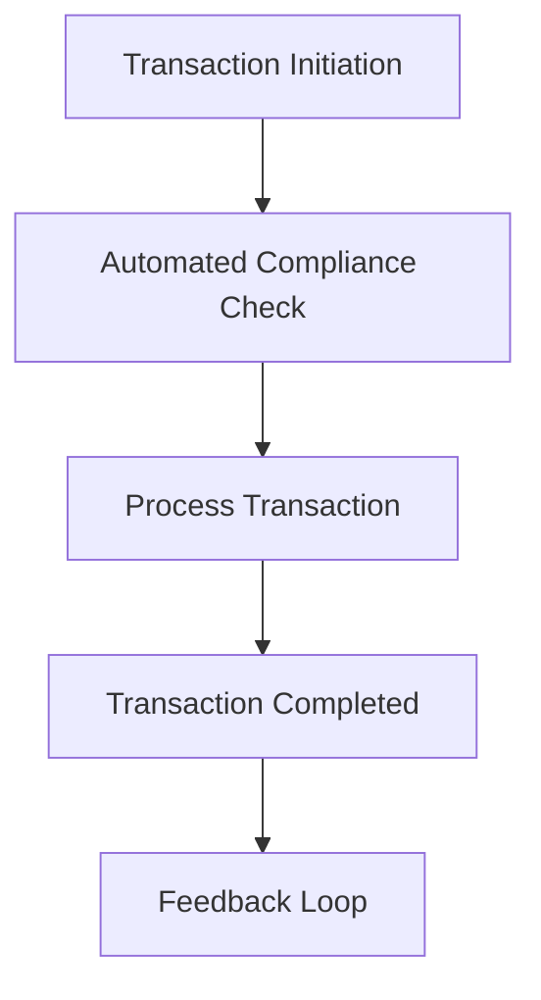

Here is the formatted Markdown version of your generated PRD:

---

# Product Requirements Document: High Volume Transaction Routing Service

---

## I. Problem Statement
- **Problem**: The current transaction processing gateway experiences intermittent latency bottlenecks during peak traffic periods.
- **Root Cause**: N/A - Not specified in source input
- **Affected Users**: Financial Institution Operators, Compliance Officers
- **Urgency & Timing**: Immediate need to enhance transaction processing capabilities to meet business goals and compliance standards.

## II. Impact of Problem
- **Quantified Impact**: Potential delays in transaction processing could lead to financial losses and customer dissatisfaction.
- **Operational / Financial Cost**: N/A - Not specified in source input
- **Risks of Inaction**: Continued latency issues may result in non-compliance with transaction processing standards and loss of customer trust.

## III. Problem Area Process Map
The current state of the transaction processing system involves manual reviews that conflict with the goal of automation. During peak times, the system struggles to maintain the required latency, leading to bottlenecks.

### Identified Bottlenecks:
- Manual review process required by compliance mandates.
- System architecture not optimized for high transaction volumes.

## IV. What is Needed to Fix the Problem
### Core Capabilities Needed:
- High-volume transaction routing automation.
- Latency optimization for transaction processing.

- **Boundary Conditions**: Compliance mandates require manual review of transactions, conflicting with the goal of 100% automation.

## V. Customer and 3rd Party Research
- **Customer Feedback**: N/A - Not specified in source input
- **3rd Party Research**: N/A - Not specified in source input
- **Analyst Insights**: N/A - Not specified in source input

## VI. Supporting Data
### Telemetry & Baseline Metrics:
- N/A - Not specified in source input

## VII. Solution Discovery, Recommendation, Teams Involved + Sizing
- **Recommended Solution**: Implement a hybrid model that allows for automated processing while incorporating compliance checks in a streamlined manner.
- **Teams Involved**: Engineering, SRE, Product, QA
- **Estimated Sizing**: N/A - Not specified in source input

## VIII. Functional and Technical Design
- **System Architecture**: The architecture will need to support high throughput and low latency while ensuring compliance checks are efficiently integrated.

### Non-Functional Requirements (NFRs):
- **Performance / Latency**: Sub-20ms transaction routing latency at 10,000 transactions per second.
- **Availability & SLA**: 99.9% uptime.
- **Security & Compliance**: Must adhere to transaction compliance standards, including data encryption and secure access controls.

## IX. To Be Process Map
The future state will automate high-volume transaction routing while ensuring compliance checks are integrated into the workflow without manual intervention.

## X. Impact Assessment / Opportunity / Metrics
- **North Star Metric**: Reduction in transaction processing time and increased throughput.
- **ROI & Opportunity**: Improved operational efficiency and customer satisfaction.

### Target KPIs:
- **Transaction Latency**: Baseline = 50ms | Target = 20ms
- **Transaction Volume**: Baseline = 5,000 TPS | Target = 10,000 TPS

## XI. Development Approach, High Level Requirements, + Epic Breakdown
### Release Phasing:
- **MVP Scope**: High-volume transaction routing automation, latency optimization.
- **Out of Scope**: Manual transaction review process.

### Epic & User Story Breakdown:
#### Epic 1: High-Volume Transaction Routing
- **User Story**: As a Financial Institution Operator, I want to automate transaction routing so that I can process transactions without delays.
- **Acceptance Criteria**:
  - **Given** a transaction is initiated
  - **When** the compliance check is performed
  - **Then** the transaction is processed automatically if compliant.

## XII. Open Questions and Decision Log
### Decisions Made:
- **Decision**: Implement a hybrid model for transaction processing (Rationale: To balance automation with compliance requirements).

### Open Questions:
- **Question**: What are the specific compliance requirements that must be integrated? | Owner: Compliance Officer

## XIII. Roster
### Project Team & RACI:
- **Product Owner**: [Role/Owner]
- **Technical Lead**: [Role/Owner]
- **QA / SRE**: [Role/Owner]

## XIV. Market Research
- **Market Size (TAM/SAM/SOM)**: N/A - Not specified in source input
- **Market Trends**: N/A - Not specified in source input

## XV. Competitive Analysis
- **Key Differentiators**: N/A - Not specified in source input

## XVI. Target Personas
- **Financial Institution Operators**: Goals: Automate transaction processing | Pain Points: Latency and manual reviews.
- **Compliance Officers**: Goals: Ensure compliance with regulations | Pain Points: Manual review bottlenecks.

## XVII. Messaging & positioning
- **Positioning**: A robust transaction processing service that balances automation with compliance.
- **Value Pillars**: Speed, Efficiency, Compliance.

## XVIII. Pricing
- **Pricing Model**: N/A - Not specified in source input
- **Tier Breakdown**: N/A - Not specified in source input

## XIX. Distribution channels & launch activities
- **Launch Phases**: Alpha/Beta/GA phases.
- **Enablement Plan**: Runbooks, documentation, training.

## XX. Support plan
- **Escalation Path**: Tier 1 -> Tier 2 -> Tier 3 engineering.
- **Runbooks & Training**: Operational monitoring and procedures.

## XXI. Reference materials
- [String Foundation PRD](https://confluence.corp.internal/display/S/String+Foundation+PRD)
- [Deliver String capability enhancements](https://jira.corp.internal/browse/S-100)
- [String Architecture and API Standards](https://confluence.corp.internal/display/S/Standards)
- [Core domain code handler in Git](https://git.corp.internal/string-service/blob/main/src/core/StringManager.java)