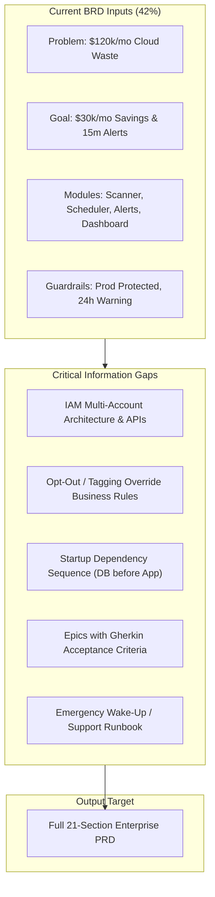

# PRD Readiness Matrix & Gap Analysis

**Source Document:** [`backend/sample_data/cloud_cost_optimizer_brd.md`](../backend/sample_data/cloud_cost_optimizer_brd.md)  
**Project:** Automated Cloud Cost Optimizer and FinOps Governance  
**Template Standard:** Enterprise 21-Section PRD Specification  
**Overall Readiness Score:** ~42% (Strong business context; significant technical, process, and operational gaps)

---

## 1. Section-by-Section PRD Readiness Matrix

| Section # | Section Name | Status | Completeness | Key Inputs Present | Missing Inputs Needed |
| :---: | :--- | :---: | :---: | :--- | :--- |
| **I** | **Problem Statement** | 🟢 Ready | 90% | \$120k/mo waste, 65% YoY spend growth across AWS/K8s, idle staging environments. | Root cause analysis on why teams abandon resources; current lack of visibility. |
| **II** | **Impact of Problem** | 🟢 Ready | 95% | Quantified \$120k monthly loss, breakdown of wasted asset types. | Secondary impacts (engineering time spent on manual audits, missed budget forecasts). |
| **III** | **Problem Area Process Map** | 🔴 Missing | 10% | Identified weekend low-utilization baseline. | As-Is manual audit workflow, SRE ticketing process, and delay points (Mermaid diagram). |
| **IV** | **What is Needed to Fix** | 🟢 Ready | 85% | 4 core functional modules defined (Scanner, Scheduler, Anomaly Alerts, Dashboard). | Boundary conditions and explicit functional limits for automated remediation. |
| **V** | **Customer & 3rd Party Research** | 🟡 Partial | 40% | FinOps domain guidelines referenced. | Internal developer interviews, feedback on past downtime incidents caused by shutdowns. |
| **VI** | **Supporting Data** | 🟢 Ready | 90% | 14% weekend utilization baseline, quarterly audit records, Jira OPS-100. | Granular breakdown of spend across top 5 largest AWS accounts/services. |
| **VII** | **Solution Discovery & Sizing** | 🔴 Missing | 20% | Existing script `ResourceUsageAnalyzer.py` identified. | Build vs. Buy evaluation (Kubecost, Vantage, CloudHealth), team resourcing, and ROM sizing. |
| **VIII** | **Functional & Tech Design** | 🔴 Missing | 25% | Basic guardrails (no prod touch, 24h warning) stated. | Multi-account IAM assume-role topology, API schemas, DB storage model, NFRs (latency, throughput). |
| **IX** | **To-Be Process Map** | 🔴 Missing | 15% | Basic 24h warning and schedule window defined. | Future-state automated workflow: Scan → Tag Check → Slack Warning → Auto-Remediation → Override path. |
| **X** | **Impact / Opportunity / Metrics** | 🟢 Ready | 85% | \$30k/mo savings target (25% reduction), 15-min anomaly alert SLA. | Measurement telemetry, dashboard reporting cadence, and tagging compliance score formula. |
| **XI** | **Requirements & Epic Breakdown** | 🟡 Partial | 35% | High-level module list. | MVP vs Phase 2 scope boundary, User stories, Gherkin acceptance criteria (`Given-When-Then`). |
| **XII** | **Open Questions & Decisions** | 🔴 Missing | 0% | None documented. | Architecture Decision Records (Lambda vs K8s CronJob, DynamoDB vs PostgreSQL, GCP timeline). |
| **XIII** | **Roster & RACI Matrix** | 🟡 Partial | 40% | Roles named (SREs, Eng Leads, Cloud Ops, CFO). | Formally assigned individual owners, approvers, and RACI matrix. |
| **XIV** | **Market Research** | ⚪ Optional | 10% | Internal enterprise initiative. | Industry FinOps maturity benchmarks (optional for internal tool). |
| **XV** | **Competitive Analysis** | ⚪ Optional | 15% | Commercial tools exist in market. | Feature comparison against internal custom scripts vs commercial SaaS tools. |
| **XVI** | **Target Personas** | 🟡 Partial | 50% | Primary user roles listed. | Detailed persona cards: SRE Lead (Operator), Software Engineer (User), CFO (Executive Buyer). |
| **XVII** | **Messaging & Positioning** | ⚪ Optional | 0% | Not provided. | Internal developer communication: framing cost governance as enablement rather than restriction. |
| **XVIII**| **Pricing & Chargeback** | ⚪ Optional | N/A | Internal tool (No direct customer billing). | Internal showback / chargeback model for departmental cloud budgets. |
| **XIX** | **Launch Activities** | 🔴 Missing | 10% | None documented. | Phased rollout schedule (Audit/Dry-Run → Pilot Staging → Full Staging → GA). |
| **XX** | **Support Plan** | 🔴 Missing | 10% | None documented. | Emergency Monday morning wake-up runbook, on-call escalation path for failed scheduler runs. |
| **XXI** | **Reference Materials** | 🟢 Ready | 75% | Repo `cloud-cost-optimizer`, file `ResourceUsageAnalyzer.py`, Jira `OPS-100`. | Architecture RFC links, IAM security policy specs, tagging standard documentation. |

---

## 2. Critical Blocking Items for PRD Generation

---

## 3. Top Stakeholder Questionnaire to Close Gaps

1. **Architecture & Multi-Account IAM (`Lead Architect` / `Security`)**:
   - How will the scanner authenticate across AWS/GCP accounts (e.g., AWS Organizations Cross-Account AssumeRole, IAM instance profiles)?
   - Where will audit history and state overrides be persisted (e.g., DynamoDB, PostgreSQL)?

2. **Opt-Out & Tagging Rules (`Cloud Ops` / `Engineering Leads`)**:
   - What exact tag key/value syntax exempts a staging resource (e.g., `Schedule=24x7` or `AutoShutdown=False`)?
   - How long can an engineer snooze or override a scheduled termination?

3. **Startup Sequence & Dependencies (`SRE Lead`)**:
   - When restarting environments at 7:00 AM, what is the required startup sequence (e.g., RDS Database first → Wait for Health Check → K8s Node Pools → App Pods)?

4. **Rollout Phasing (`Product Manager`)**:
   - Does Phase 1 (MVP) execute automated shutdowns, or operate in "Dry-Run / Recommendation Only" mode via Slack notifications?
   - Is multi-cloud (GCP) included in the MVP or deferred to Phase 2?

5. **Operational Recovery & Runbooks (`Site Reliability Engineering`)**:
   - If an automated shutdown causes an unpredicted outage or fails to wake up on Monday morning, what is the instant manual recovery procedure and on-call escalation path?
