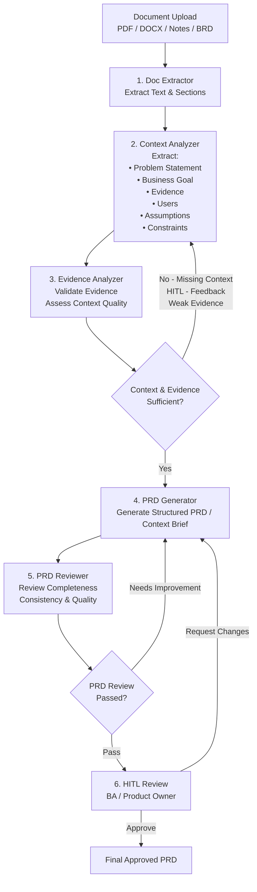

```mermaid
flowchart TD

    A[Document Upload<br/>PDF / DOCX / Notes / BRD]

    B[1. Doc Extractor<br/>Extract Text & Sections]

    C[2. Context Analyzer<br/>Extract:<br/>• Problem Statement<br/>• Business Goal<br/>• Evidence<br/>• Users<br/>• Assumptions<br/>• Constraints]

    D[3. Evidence Analyzer<br/>Validate Evidence<br/>Assess Context Quality]

    E{Context & Evidence<br/>Sufficient?}

    F[4. PRD Generator<br/>Generate Structured PRD / Context Brief]

    G[5. PRD Reviewer<br/>Review Completeness<br/>Consistency & Quality]

    H{PRD Review<br/>Passed?}

    I[6. HITL Review<br/>BA / Product Owner]

    J[Final Approved PRD]

    A --> B
    B --> C
    C --> D

    D --> E

    E -->|No - Missing Context <br/>HITL - Feedback<br/>Weak Evidence| C
    E -->|Yes| F

    F --> G

    G --> H

    H -->|Needs Improvement| F
    H -->|Pass| I

    I -->|Request Changes| F
    I -->|Approve| J
```
