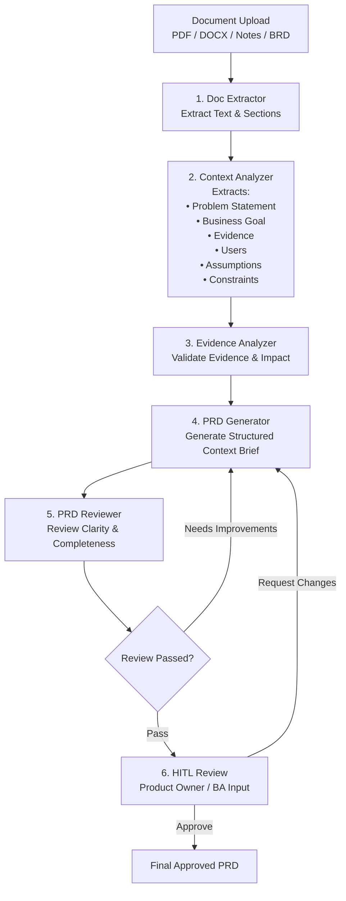

```mermaid
flowchart TD

    A[Document Upload<br/>PDF / DOCX / Notes / BRD]

    B[1. Doc Extractor<br/>Extract Text & Sections]

    C[2. Context Analyzer<br/>Extracts:<br/>• Problem Statement<br/>• Business Goal<br/>• Evidence<br/>• Users<br/>• Assumptions<br/>• Constraints]

    D[3. Evidence Analyzer<br/>Validate Evidence & Impact]

    E[4. PRD Generator<br/>Generate Structured Context Brief]

    F[5. PRD Reviewer<br/>Review Clarity & Completeness]

    G{Review Passed?}

    H[6. HITL Review<br/>Product Owner / BA Input]

    I[Final Approved PRD]

    A --> B
    B --> C
    C --> D
    D --> E
    E --> F

    F --> G

    G -->|Pass| H
    G -->|Needs Improvements| E

    H -->|Approve| I
    H -->|Request Changes| E
```