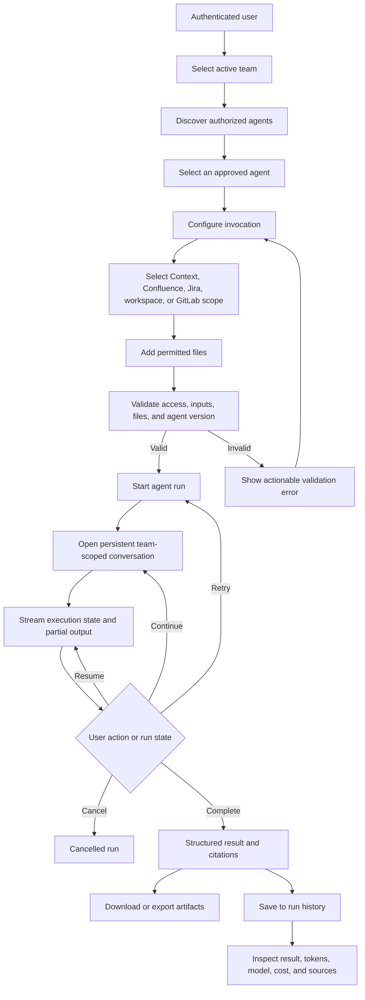
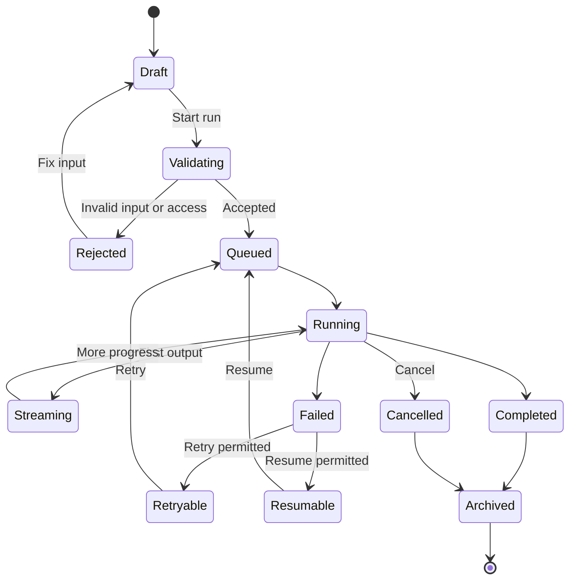

# Digital Intelligence Hub

## Product Overview

Digital Intelligence Hub is a team-scoped web workspace for discovering authorized AI agents, selecting approved knowledge sources, uploading supporting files, starting agent runs, continuing conversations, viewing streamed results, and inspecting historical usage.

The portal must show only the agents, sources, workspaces, and actions that the authenticated user is entitled to use for the active team.

## Primary Goals

1. Provide secure discovery of agents enabled for the active team.
2. Allow an entitled user to invoke the active approved version of an agent.
3. Support Context, Confluence, and Jira as selectable knowledge sources.
4. Support permitted file uploads with validation and processing status.
5. Provide persistent team-scoped conversations around agent runs.
6. Stream execution progress and partial results.
7. Render output according to its type: Markdown, tables, JSON, citations, and source code.
8. Support permitted cancellation, retry, resume, artifact download, and export.
9. Provide searchable run history with results, model usage, token usage, and estimated cost.

## Scope and Access Model

### Active team

The authenticated user has one active team at a time. The active team controls:

- Which agents appear in discovery.
- Which agent versions can be invoked.
- Which Context stores are available.
- Which Confluence spaces and pages can be searched.
- Which Jira projects, boards, issues, and filters can be used.
- Which workspaces or GitLab codebases can be selected.
- Which file types, file sizes, and actions are permitted.
- Which historical runs and artifacts are visible.

Changing the active team must refresh agents, source permissions, conversations, and run history. Data from another team must not remain visible after the switch.

### Authorization rules

The UI is not the security boundary. Every agent, source, file, run, and artifact request must be authorized again by the backend.

The backend should verify:

- User identity and active team membership.
- Agent entitlement and active approved version.
- Source-level access for Context, Confluence, Jira, workspace, or GitLab.
- File type, size, malware status, and retention rules.
- Permission to cancel, retry, resume, download, or export a run.

## End-to-End User Flow



## Screen Requirements

### 1. Discover Agents

Purpose: help the user find an approved capability without exposing unauthorized agents.

Required UI:

- Product name: **Digital Intelligence Hub**.
- Active team selector.
- Search by agent name, task, or capability.
- Agent cards showing:
  - Name and description.
  - Availability status.
  - Active approved version.
  - Supported inputs and output types.
  - Supported sources.
  - Recent usage or run count, when permitted.
  - `Use agent` action.
- Empty state when no agents are enabled.
- Optional `Browse agent catalog` or `Request access` entry for unavailable capabilities.

The catalog entry is not an executable agent. It should explain that the capability is not enabled for the active team and provide a request-access path.

Recommended initial visible agents:

- Context Analyzer.
- Evidence Analyzer.
- PRD Generator.
- PRD Reviewer.

Only show agents returned by the authorization-aware discovery API.

### 2. Agent Invocation

Purpose: collect validated inputs before starting a run.

Required UI:

- Selected agent name.
- Active approved version.
- Agent input instructions and required fields.
- Knowledge source selector with three options:
  - **Context**: conversation context, uploaded files, or an authorized context store.
  - **Confluence**: authorized spaces, pages, labels, or search results.
  - **Jira**: authorized projects, boards, issues, filters, or issue keys.
- Ability to combine authorized sources when supported by the agent.
- Source-specific scope controls.
- Prompt or task description.
- Workspace or GitLab codebase selector when supported.
- File upload area.
- Selected source summary.
- Estimated tokens and cost, when available.
- Team entitlement and access status.
- Start run action.

The screen must clearly state what data will be used for the run. A user should be able to remove a source or file before starting.

### 3. File Upload

Required behavior:

- Support drag and drop and file browsing.
- Display selected file name, type, size, and upload status.
- Allow file removal before submission.
- Validate extension and MIME type.
- Validate maximum file size and total request size.
- Show upload progress for large files.
- Reject unsupported or unauthorized files with a clear reason.
- Scan files before agent processing.
- Preserve file-to-run association.
- Do not expose files to agents outside the authorized run scope.

Suggested initial types: PDF, DOCX, XLSX, CSV, TXT, PNG, JPG, and source-code files, subject to agent configuration.

### 4. Conversation and Agent Selection

Purpose: provide a persistent team-scoped place to invoke and continue an agent interaction.

Required behavior:

- Create a conversation when the user starts a run.
- Persist messages, selected agent, selected sources, attachments, and run references.
- Keep the conversation scoped to the active team.
- Allow follow-up prompts using the same agent when permitted.
- Detect user intent from a prompt and recommend an authorized agent when the user has not selected one.
- Require explicit confirmation before invoking a recommended agent.
- Never recommend or invoke an agent unavailable to the active team.
- Display the selected agent and source scope in the conversation header.
- Allow a user to start a new conversation without losing completed history.

Example intent behavior:

```text
User: "Review this PRD for missing acceptance criteria."
System: "PRD Reviewer is available for your team. Use it with the attached file?"
User: "Start review"
System: Starts a PRD Reviewer run after authorization and input validation.
```

### 5. Live Execution and Results

Purpose: make long-running execution understandable and interruptible.

Required UI:

- Run identifier and current status.
- Execution timeline with stages such as:
  - Input validation.
  - File processing.
  - Source retrieval.
  - Agent reasoning or analysis.
  - Result preparation.
- Progress indicator where measurable.
- Partial results while the run is active.
- Elapsed time.
- Token usage.
- Model or deployment name, when permitted.
- Estimated cost.
- Cancel action when permitted.
- Retry action for retryable failures.
- Resume action for resumable runs.
- Clear status for queued, running, completed, failed, cancelled, and expired runs.

### Output viewers

| Output type | Viewer behavior |
|---|---|
| Markdown | Render headings, lists, links, emphasis, and safe tables. |
| Table | Provide readable columns, sorting where useful, and CSV export. |
| JSON | Format, syntax-highlight, collapse nested objects, and allow copy/download. |
| Citations | Show source title, source system, location, and link when available. |
| Source code | Syntax-highlight by language and provide copy/download. |
| Artifact | Show file name, type, size, and download/export action. |
| Error | Show the failed stage, safe explanation, retry eligibility, and support reference. |

Results should distinguish generated content from source evidence. Citations must remain attached to the relevant claim or result section whenever the agent provides them.

### 6. Run History

Purpose: let authorized users find and inspect previous executions.

Required UI:

- Search by run title, run ID, agent, source, or user.
- Filters for agent, status, source, team, and date range.
- Run title and run ID.
- Agent name and version.
- Created date and duration.
- Status.
- Source summary.
- File summary.
- Token usage.
- Model or deployment usage.
- Estimated cost.
- Open result action.
- Download artifact action.
- Export result action.
- More-actions menu for retry or resume when permitted.

History visibility must follow team and user permissions. A user must not access another team\'s conversation, source citation, artifact, or usage details.

## State Model



## Core Data Contracts

### Agent discovery

```json
{
  "teamId": "team-km",
  "agents": [
    {
      "id": "context-analyzer",
      "name": "Context Analyzer",
      "description": "Extract structured context from approved sources and files.",
      "activeVersion": "2.4",
      "status": "available",
      "supportedSources": ["context", "confluence", "jira"],
      "supportedInputs": ["text", "file"],
      "outputTypes": ["markdown", "table", "json", "citation"]
    }
  ]
}
```

### Run request

```json
{
  "teamId": "team-km",
  "agentId": "context-analyzer",
  "agentVersion": "2.4",
  "conversationId": "conversation-123",
  "prompt": "Analyze the onboarding context and identify constraints.",
  "sources": [
    {
      "type": "context",
      "scopeId": "km-shared-store"
    },
    {
      "type": "confluence",
      "scopeId": "onboarding-space",
      "resourceIds": ["page-101", "page-102"]
    },
    {
      "type": "jira",
      "scopeId": "project-KM",
      "resourceIds": ["KM-2481"]
    }
  ],
  "fileIds": ["file-001", "file-002"]
}
```

### Run event

```json
{
  "runId": "run-KM-2481",
  "conversationId": "conversation-123",
  "status": "running",
  "stage": "analyzing",
  "progress": 68,
  "message": "Extracting themes and confidence signals.",
  "tokens": {
    "input": 6200,
    "output": 2220,
    "total": 8420
  },
  "model": "approved-model-deployment",
  "estimatedCost": 0.08,
  "createdAt": "2026-09-23T10:42:00Z"
}
```

## API Surface

The exact service names may change, but the portal requires these capabilities:

| Capability | Purpose |
|---|---|
| `GET /api/teams/active` | Return the user\'s active team and team metadata. |
| `GET /api/teams/{teamId}/agents` | Return authorized agents and active versions. |
| `GET /api/teams/{teamId}/sources` | Return authorized Context, Confluence, Jira, workspace, and GitLab scopes. |
| `POST /api/files` | Upload and validate a permitted file. |
| `DELETE /api/files/{fileId}` | Remove a file before the run starts. |
| `POST /api/conversations` | Create a team-scoped conversation. |
| `GET /api/conversations/{conversationId}` | Load conversation messages and run references. |
| `POST /api/runs` | Validate and start an authorized agent run. |
| `GET /api/runs/{runId}/events` | Stream progress and partial result events. |
| `POST /api/runs/{runId}/cancel` | Cancel a permitted active run. |
| `POST /api/runs/{runId}/retry` | Retry a permitted retryable run. |
| `POST /api/runs/{runId}/resume` | Resume a permitted resumable run. |
| `GET /api/runs` | Search and filter authorized run history. |
| `GET /api/runs/{runId}` | Inspect result, sources, usage, and status. |
| `GET /api/runs/{runId}/artifacts/{artifactId}` | Download an authorized artifact. |
| `POST /api/runs/{runId}/exports` | Create an authorized export. |

The existing frontend currently streams chat messages through `/api/chat`. The future run API can reuse the existing UI message streaming approach while adding team, agent, source, run, and usage metadata.

## Error Requirements

Every error should include a safe user-facing message, a stable error code, and whether the action can be retried.

Required cases:

- User is not authenticated.
- Active team is missing or changed.
- Agent is not enabled for the active team.
- Agent version is no longer approved.
- Source access has expired or been revoked.
- Confluence space or page is unavailable.
- Jira project, issue, board, or filter is unavailable.
- File type or size is not permitted.
- File scan fails.
- Upload fails.
- Input validation fails.
- Run queue is unavailable.
- Model provider fails.
- Stream disconnects.
- Run is cancelled.
- Run expires before completion.
- Artifact is unavailable or user is not authorized.

## Security and Privacy Requirements

- Keep provider credentials server-side.
- Enforce authorization on every API request.
- Use least-privilege source tokens and scopes.
- Never trust team, agent, source, file, or run identifiers supplied by the browser.
- Redact secrets and sensitive source content from logs.
- Apply file retention and deletion policies.
- Record audit events for invocation, source access, cancellation, retry, resume, download, and export.
- Prevent cross-team conversation and artifact access.
- Sanitize rendered Markdown, links, HTML, code, and citations.
- Apply request limits, upload limits, and rate limits.

## Acceptance Criteria

### Discovery

- [ ] User sees only agents enabled for the active team.
- [ ] Each agent shows its approved active version.
- [ ] Unauthorized agents cannot be invoked by manually changing an ID.
- [ ] Catalog or request-access content is clearly distinct from available agents.

### Invocation and sources

- [ ] User can select Context, Confluence, and Jira when authorized.
- [ ] User can combine sources when the selected agent supports it.
- [ ] Confluence scope can be narrowed to authorized spaces or pages.
- [ ] Jira scope can be narrowed to authorized projects, boards, issues, or filters.
- [ ] The final source scope is visible before starting.
- [ ] Agent version and team entitlement are visible before starting.
- [ ] Invalid or unauthorized requests are blocked by the backend.

### Files

- [ ] User can drag, drop, browse, inspect, and remove files.
- [ ] Unsupported files are rejected with a clear reason.
- [ ] Upload progress and processing status are visible.
- [ ] Files are associated only with the selected conversation and run.

### Conversation and execution

- [ ] Starting `Use agent` opens a configured invocation flow.
- [ ] Starting a valid run creates or reuses a team-scoped conversation.
- [ ] Progress and partial output stream into the conversation.
- [ ] User can cancel when permitted.
- [ ] Retry and resume appear only when supported by the run state.
- [ ] Disconnected streams do not corrupt conversation state.

### Results and history

- [ ] Markdown, tables, JSON, citations, source code, and artifacts have suitable viewers.
- [ ] Sources are shown with generated results.
- [ ] Completed runs expose downloads and supported exports.
- [ ] History supports search and filtering.
- [ ] History shows status, agent version, tokens, model, cost, and duration when authorized.
- [ ] Users cannot inspect another team\'s runs or artifacts.

## Frontend Alignment

Current implementation anchors:

- `src/App.tsx`: owns active chat state, sessions, files, and streaming status.
- `src/components/ChatComposer.tsx`: collects text and multiple files.
- `src/components/MessageList.tsx`: renders assistant messages and attachments.
- `src/services/aiService.ts`: configures the chat transport.
- `api/chat.ts`: receives chat requests and streams Azure OpenAI output.
- `docs/chat-architecture-flow.md`: documents the current chat transport.

Recommended next frontend boundaries:

- `AgentDiscovery`: authorized agent cards and search.
- `AgentInvocation`: agent version, source scope, prompt, files, and validation.
- `SourceSelector`: Context, Confluence, Jira, workspace, and GitLab scopes.
- `RunTimeline`: status, progress, cancellation, retry, and resume.
- `OutputViewer`: Markdown, tables, JSON, citations, code, and artifacts.
- `RunHistory`: filtering, usage, cost, downloads, and exports.

## Design Direction

The mockup uses a quiet enterprise workspace style:

- Product name: Digital Intelligence Hub.
- Compact dark navigation rail.
- Neutral workspace background with restrained blue action color.
- Lime status accent for approved or completed states.
- Clear authorization and source-scope summaries.
- Dense tables for history and structured output tabs for results.
- No marketing landing page; the first screen is the working product.
